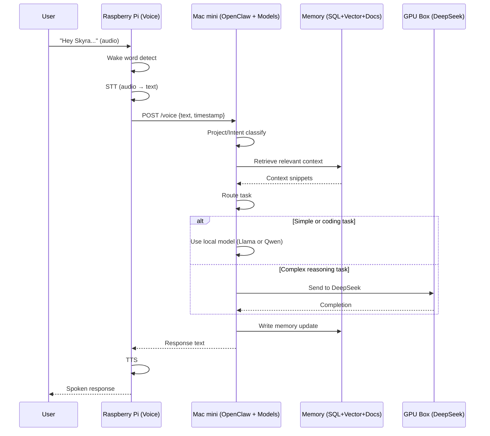

# Personal AI "Jarvis" AKA Skyra – End-Goal Architecture

## 1. Goals

- Always-on personal assistant with voice interaction.
- Project-centric memory (gym, work, music, servers, etc.).
- Private, local-first inference.
- Modular hardware that can scale over time.
- Fast local responses with automatic escalation to a high-reasoning GPU model.

## 2. High-Level Architecture

The system is composed of three main machines:

- **Raspberry Pi** → Voice interface (wake word, STT, TTS)
- **Mac mini** → Control plane (API, OpenClaw agent, memory, tools, fast local models)
- **GPU Machine** → Heavy reasoning model (DeepSeek LLM server)

Each machine has a clear responsibility.

## 3. Model Roles

The system uses multiple specialized models instead of a single monolithic model.

### Mac mini (fast, always-on models)

**Conversational Model**
- Example: Llama 3.1 8B Instruct
- Handles:
  - General conversation
  - Intent detection
  - Clarifications
  - Task routing

**Coding / Tool Model**
- Example: Qwen2.5-Coder 7B
- Handles:
  - Script generation
  - Code editing
  - Tool execution
  - CLI-style tasks

### GPU Machine (heavy reasoning model)

**Primary Reasoning Model**
- Example: DeepSeek-Coder 33B+
- Handles:
  - Complex coding
  - Architecture decisions
  - Multi-file reasoning
  - Deep debugging
  - Long-context tasks

## 4. System Topology Diagram

```mermaid
flowchart LR
  %% ===== Nodes =====
  subgraph PI[Raspberry Pi • Voice Node]
    WW[Wake Word\n(openWakeWord/Porcupine)]
    STT[Speech-to-Text\n(Whisper small/base)]
    TTS[Text-to-Speech\n(Piper/Coqui)]
    VCLIENT[Voice Client\nHTTP/gRPC to API]
    WW --> STT --> VCLIENT
  end

  subgraph MAC[Mac mini (M4, 24GB) • Control Plane]
    APIGW[API Gateway\n(FastAPI/Node)\n/voice /chat /tools /memory]
    AGENT[OpenClaw Agent Runtime\nOrchestrator + Router]
    CLASS[Project + Intent Classifier]

    CHAT[Conversational Model\nLlama 3.1 8B]
    CODER[Coding Model\nQwen2.5-Coder 7B]

    MEMSVC[Memory Service\n(Read/Write, Summaries)]
    TOOLS[Tool/Skills Runner\n(SSH, scripts, Slack, etc.)]
    SQL[(Relational DB\nPostgres/SQLite\nprojects, timeline)]
    VDB[(Vector DB\nQdrant/Chroma\nembeddings)]
    OBJ[(Object Store\nFiles/MinIO\nnotes, docs)]

    APIGW --> AGENT
    AGENT --> CLASS
    AGENT --> CHAT
    AGENT --> CODER
    AGENT --> MEMSVC
    MEMSVC --> SQL
    MEMSVC --> VDB
    MEMSVC --> OBJ
    AGENT --> TOOLS
  end

  subgraph GPU[GPU Machine • Compute Plane]
    LLM[DeepSeek Reasoning Model\n(33B+)\nLLM Server]
  end

  %% ===== Links between machines =====
  VCLIENT -->|text transcript| APIGW
  AGENT -->|complex task| LLM
  LLM -->|completion| AGENT
  AGENT -->|final response| APIGW
  APIGW -->|text for speech| TTS
```

## 5. Voice Request Flow



## 6. Component Responsibilities

### 5.1 Raspberry Pi – Voice Node

**Purpose**: Always-on audio interface.

**Services**:
- Wake word detection
- Speech-to-text (STT)
- Text-to-speech (TTS)
- Voice client that sends text to Mac mini

**Characteristics**:
- Lightweight compute
- Always powered on
- Local network only

### 5.2 Mac mini – Control Plane

**Purpose**: Orchestration, memory, APIs, tools, and fast local models.

**Services**:
- API gateway (/chat, /voice, /tools, /memory)
- OpenClaw agent runtime (orchestrator + router)
- Project classifier
- Model router
- Memory service
- Tool execution engine
- Databases
- Local conversational model
- Local coding/tool model

**Local Models**:

| Model | Role |
|-------|------|
| Llama 3.1 8B Instruct | Conversational interface and routing |
| Qwen2.5-Coder 7B | Coding and tool execution |

**Datastores**:
- Relational DB (projects, events, preferences)
- Vector DB (embeddings)
- Object storage (documents)

### 5.3 GPU Machine – Compute Plane

**Purpose**: Heavy reasoning and large-model inference.

**Services**:
- DeepSeek-Coder (33B+)
- LLM server (vLLM, TGI, or Ollama)

**Characteristics**:
- Dedicated GPU
- High VRAM
- Private network access only

**Model Role**:

| Model | Purpose |
|-------|---------|
| DeepSeek-Coder 33B+ | Main reasoning brain |

## 7. Memory Architecture

### 7.1 Structured Data (Relational DB)

**Tables**:
- projects
- subprojects
- events (timestamped facts)
- preferences

### 7.2 Vector Memory

**Stores**:
- Embedded conversation chunks
- Embedded documents

**Metadata**:
- project_id
- timestamp
- importance
- source_type

### 7.3 Object Storage

**Stores**:
- PDFs
- Markdown notes
- Logs
- Audio files
- Attachments

## 8. Retrieval Strategy (Semantic + Temporal)

1. Classifier determines project domain.
2. Vector DB retrieves top-K similar entries.
3. Results are re-ranked by:
   - Recency
   - Importance
   - Source reliability
4. Top results injected into LLM prompt.

**Rule**: Similarity finds what; metadata decides which version.

## 9. OpenClaw Integration

OpenClaw runs on the Mac mini as the central orchestrator and model router.

**Agent pipeline**:
1. Receive message
2. Run project and intent classifier
3. Retrieve memory context
4. Route task:
   - Llama (conversation)
   - Qwen (coding/tools)
   - DeepSeek (GPU reasoning)
5. Execute tools if needed
6. Write memory updates
7. Return final response

## 10. Network Layout

### Logical network
- All machines on same LAN/VLAN
- Token or mTLS between services
- No public exposure of GPU machine

### Trust zones
| Zone | Machine | Role |
|------|---------|------|
| Edge | Raspberry Pi | Voice input/output |
| Control | Mac mini | Orchestration + memory + fast models |
| Compute | GPU box | Deep reasoning model |

## 11. Deployment Strategy

### Phase 1 (single machine)
Mac mini runs:
- Llama conversational model
- Qwen coding model
- API
- Memory
- OpenClaw agent

### Phase 2 (two machines)
- GPU box hosts DeepSeek
- Mac mini runs control plane + local models

### Phase 3 (three machines)
- Raspberry Pi handles voice
- Full modular architecture

## 12. Security Baseline

- Token-based service authentication
- Separate service accounts
- Tool allow-list
- Audit logs
- Encrypted backups

## 13. End-State Role Assignment

| Machine | Role |
|---------|------|
| GPU Box | DeepSeek reasoning model |
| Mac mini | OpenClaw agent, APIs, memory, tools, fast models |
| Raspberry Pi | Voice interface |

## 14. Example Capabilities

- "What did I decide about the Tekkit backups last week?"
- "Switch to work mode—draft a SOC2 response."
- "Gym mode—suggest next week's lifts."
- "Music mode—ideas for SKANZ Vol. 3."
- "Server mode—summarize crash logs."

For every request:

**Input**:
- User message
- Recent chat history
- Project registry

**Output**:
- project_id
- intent
- confidence score

If confidence is low:
- Ask clarification
- Or search across multiple projects

## 9. OpenClaw Integration

OpenClaw runs on the Mac mini.

**Agent pipeline**:
1. Receive message
2. Run classifier
3. Retrieve memory
4. Call LLM on GPU box
5. Execute tools if needed
6. Write memory updates
7. Return final response

## 10. Network Layout

### Logical network
- All machines on same LAN/VLAN
- Token or mTLS between services
- No public exposure of GPU machine

### Trust zones
| Zone | Machine | Role |
|------|---------|------|
| Edge | Raspberry Pi | Voice input/output |
| Control | Mac mini | Orchestration + memory |
| Compute | GPU box | Model inference |

## 11. Deployment Strategy

### Phase 1 (single machine)
Mac mini runs:
- Local model
- API
- Memory
- Agent

### Phase 2 (two machines)
- GPU box hosts model
- Mac mini runs control plane

### Phase 3 (three machines)
- Raspberry Pi handles voice
- Full modular architecture

## 12. Security Baseline

- Token-based service authentication
- Separate service accounts
- Tool allow-list
- Audit logs
- Encrypted backups

## 13. Telemetry and Monitoring

### 13.1 Model-Level Metrics
- Request count per model (Llama/Qwen vs DeepSeek)
- Response times and token counts
- GPU utilization during DeepSeek calls
- Memory usage per inference request
- Cache hit rates for local models

### 13.2 User Interaction Metrics
- Voice-to-text latency
- End-to-end request/response time
- Routing decision accuracy (was DeepSeek escalation needed?)
- User satisfaction signals (voice follow-ups, task completion)

### 13.3 System Health
- Network latency between machines
- Database query performance
- Model warm-up times
- Error rates and fallback triggers

### 13.4 Cost Tracking
- Energy consumption per machine
- GPU compute time cost estimates
- Storage usage trends
- Peak vs average resource utilization

### 13.5 Implementation
- Prometheus metrics on each machine
- Simple dashboard in the Mac mini control plane
- Alerts when DeepSeek usage spikes unusually
- Weekly summaries of model usage patterns

### 13.6 Key Focus: Routing Efficiency
Track the system's ability to correctly choose local vs GPU models and analyze the tradeoffs between response time and accuracy.

## 14. End-State Role Assignment

| Machine | Role |
|---------|------|
| GPU Box | DeepSeek reasoning model |
| Mac mini | OpenClaw agent, APIs, memory, tools, fast models |
| Raspberry Pi | Voice interface |

## 15. Example Capabilities

- "What did I decide about the Tekkit backups last week?"
- "Switch to work mode—draft a SOC2 response."
- "Gym mode—suggest next week's lifts."
- "Music mode—ideas for SKANZ Vol. 3."
- "Server mode—summarize crash logs."

## Notes


