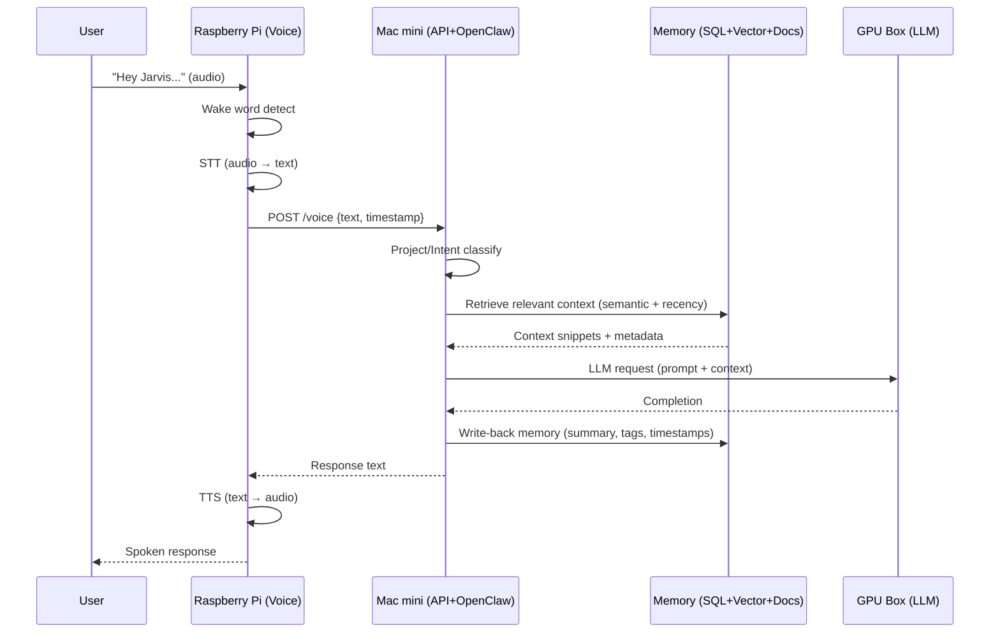

# Personal AI "Jarvis" – End-Goal Architecture

## 1. Goals

- Always-on personal assistant with voice interaction.
- Project-centric memory (gym, work, music, servers, etc.).
- Private, local-first inference.
- Modular hardware that can scale over time.

## 2. High-Level Architecture

The system is composed of three main machines:

- **Raspberry Pi** → Voice interface (wake word, STT, TTS)
- **Mac mini** → Control plane (API, agent, memory, tools)
- **GPU Machine** → Model inference (LLM server)

Each machine has a clear responsibility.

## 3. System Topology Diagram

```mermaid
flowchart LR
  %% ===== Nodes =====
  subgraph PI[Raspberry Pi • Voice Node]
    WW[Wake Word\n(openWakeWord/Porcupine)]
    STT[Speech-to-Text\n(Whisper small/base)]
    TTS[Text-to-Speech\n(Piper/Coqui)]
    VCLIENT[Voice Client\nHTTP/gRPC to API]
    WW --> STT --> VCLIENT
  end

  subgraph MAC[Mac mini (M4, 24GB) • Control Plane]
    APIGW[API Gateway\n(FastAPI/Node)\n/voice /chat /tools /memory]
    AGENT[OpenClaw Agent Runtime\nOrchestrator]
    CLASS[Project + Intent Classifier]
    MEMSVC[Memory Service\n(Read/Write, Summaries)]
    TOOLS[Tool/Skills Runner\n(SSH, scripts, Slack, etc.)]
    SQL[(Relational DB\nPostgres/SQLite\nprojects, timeline)]
    VDB[(Vector DB\nQdrant/Chroma\nembeddings)]
    OBJ[(Object Store\nFiles/MinIO\nnotes, docs)]

    APIGW --> AGENT
    AGENT --> CLASS
    AGENT --> MEMSVC
    MEMSVC --> SQL
    MEMSVC --> VDB
    MEMSVC --> OBJ
    AGENT --> TOOLS
  end

  subgraph GPU[GPU Machine • Compute Plane]
    LLM[LLM Inference Server\n(vLLM/TGI/llama.cpp/Ollama)\nOpenAI-compatible /v1/*]
    EMB[Optional Embeddings/Rerank\n(service)]
  end

  %% ===== Links between machines =====
  VCLIENT -->|text transcript| APIGW
  AGENT -->|prompt + context| LLM
  LLM -->|completion| AGENT
  AGENT -->|final response| APIGW
  APIGW -->|text for speech| TTS
```

## 4. Voice Request Flow



## 5. Component Responsibilities

### 5.1 Raspberry Pi – Voice Node

**Purpose**: Always-on audio interface.

**Services**:
- Wake word detection
- Speech-to-text (STT)
- Text-to-speech (TTS)
- Voice client that sends text to Mac mini

**Characteristics**:
- Lightweight compute
- Always powered on
- Local network only

### 5.2 Mac mini – Control Plane

**Purpose**: Orchestration, memory, APIs, and tools.

**Services**:
- API gateway (/chat, /voice, /tools, /memory)
- OpenClaw agent runtime
- Project classifier
- Memory service
- Tool execution engine
- Databases

**Datastores**:
- Relational DB (projects, events, preferences)
- Vector DB (embeddings)
- Object storage (documents)

### 5.3 GPU Machine – Compute Plane

**Purpose**: Heavy LLM inference.

**Services**:
- LLM server (vLLM, TGI, llama.cpp, or Ollama)
- Optional embedding or reranker services

**Characteristics**:
- Dedicated GPU
- High VRAM
- Private network access only

## 6. Memory Architecture

### 6.1 Structured Data (Relational DB)

**Tables**:
- projects
- subprojects
- events (timestamped facts)
- preferences

### 6.2 Vector Memory

**Stores**:
- Embedded conversation chunks
- Embedded documents

**Metadata**:
- project_id
- timestamp
- importance
- source_type

### 6.3 Object Storage

**Stores**:
- PDFs
- Markdown notes
- Logs
- Audio files
- Attachments

## 7. Retrieval Strategy (Semantic + Temporal)

1. Classifier determines project domain.
2. Vector DB retrieves top-K similar entries.
3. Results are re-ranked by:
   - Recency
   - Importance
   - Source reliability
4. Top results injected into LLM prompt.

**Rule**: Similarity finds what; metadata decides which version.

## 8. Project Classifier (First-Class Citizen Model)

For every request:

**Input**:
- User message
- Recent chat history
- Project registry

**Output**:
- project_id
- intent
- confidence score

If confidence is low:
- Ask clarification
- Or search across multiple projects

## 9. OpenClaw Integration

OpenClaw runs on the Mac mini.

**Agent pipeline**:
1. Receive message
2. Run classifier
3. Retrieve memory
4. Call LLM on GPU box
5. Execute tools if needed
6. Write memory updates
7. Return final response

## 10. Network Layout

### Logical network
- All machines on same LAN/VLAN
- Token or mTLS between services
- No public exposure of GPU machine

### Trust zones
| Zone | Machine | Role |
|------|---------|------|
| Edge | Raspberry Pi | Voice input/output |
| Control | Mac mini | Orchestration + memory |
| Compute | GPU box | Model inference |

## 11. Deployment Strategy

### Phase 1 (single machine)
Mac mini runs:
- Local model
- API
- Memory
- Agent

### Phase 2 (two machines)
- GPU box hosts model
- Mac mini runs control plane

### Phase 3 (three machines)
- Raspberry Pi handles voice
- Full modular architecture

## 12. Security Baseline

- Token-based service authentication
- Separate service accounts
- Tool allow-list
- Audit logs
- Encrypted backups

## 13. End-State Role Assignment

| Machine | Role |
|---------|------|
| GPU Box | LLM inference |
| Mac mini | APIs, agent, memory, tools |
| Raspberry Pi | Voice interface |

## 14. Example Capabilities

- "What did I decide about the Tekkit backups last week?"
- "Switch to work mode—draft a SOC2 response."
- "Gym mode—suggest next week's lifts."
- "Music mode—ideas for SKANZ Vol. 3."
- "Server mode—summarize crash logs."

---

If you'd like, I can next:
- Generate a repo scaffold (docker-compose.yml, folder layout, env files).
- Produce a Phase-1 quickstart you can run on just the Mac mini.
- Convert this into a Confluence-style or SOC-2-style architecture doc.