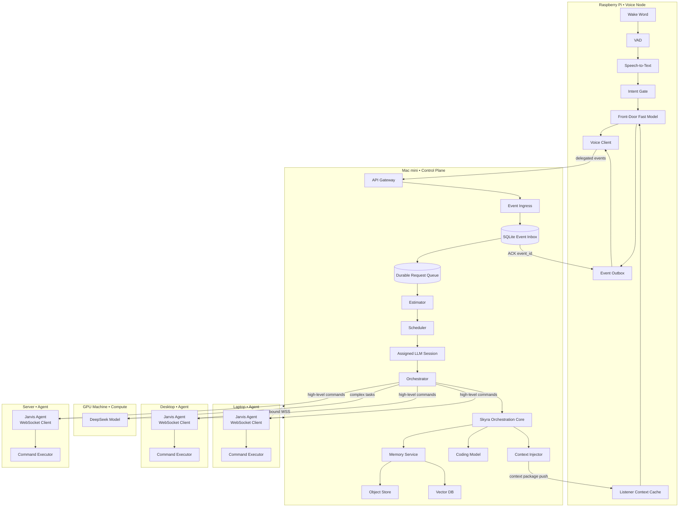
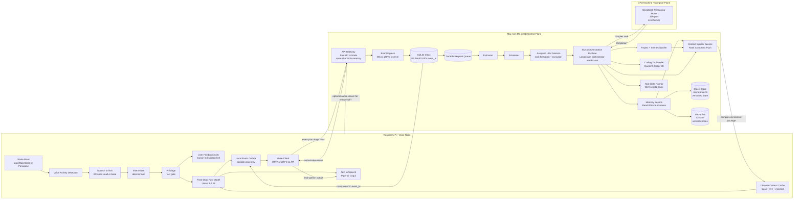
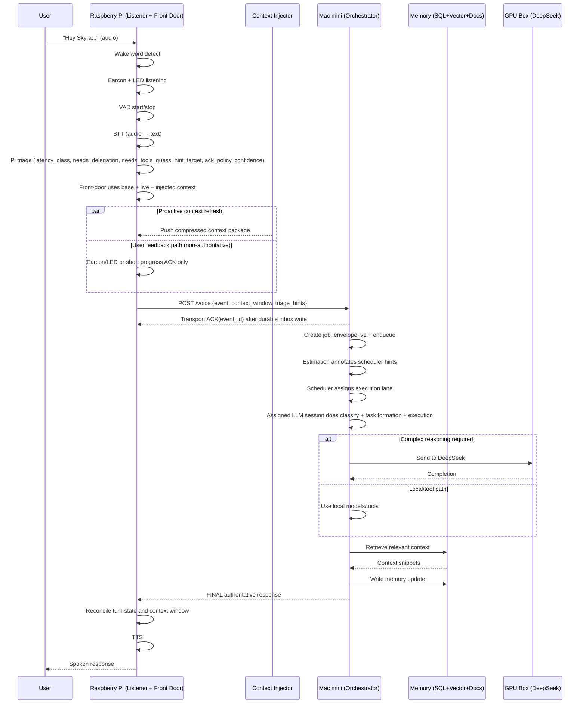

# Personal AI "Jarvis" AKA Skyra – End-Goal Architecture

## 1. Goals

- Always-on personal assistant with voice interaction.
- Project-centric memory (gym, work, music, servers, etc.).
- Private, local-first inference.
- Modular hardware that can scale over time.
- Fast local responses with automatic escalation to a high-reasoning GPU model.

## 2. High-Level Architecture

The system is composed of three main machines:

- **Raspberry Pi** → Voice interface (wake word, STT, TTS)
- **Mac mini** → Control plane (API, orchestration runtime, memory, tools, fast local models)
- **GPU Machine** → Heavy reasoning model (DeepSeek LLM server)

Each machine has a clear responsibility.

## 3. Distributed Agent Architecture

### 3.1 Agent Model Overview

Each computer (laptop, desktop, server) runs a lightweight "Jarvis Agent" that extends the system's reach beyond the central control plane. The Mac mini remains the central orchestrator, sending high-level commands to agents for execution.

**Jarvis Agents are execution-only components and do not perform reasoning, memory access, or model inference.**

**Key Concepts:**

- **Control Plane**: Mac mini maintains intelligence, memory, and decision-making
- **Jarvis Agents**: Lightweight services on target machines
- **Command Distribution**: High-level intents sent to agents for execution
- **Secure Execution**: Allowlisted actions only, with authenticated connections

### 3.2 Distributed System Diagram



### 3.3 Agent Security Model

#### Authentication & Authorization

- **Token-based authentication** using mTLS or JWT tokens
- **Allowlisted commands only** - agents reject unknown actions
- **Non-root execution** - agents run as unprivileged users
- **Audit logging** - all commands logged with timestamps and results

#### Command Allowlist

```json
{
  "allowed_actions": {
    "open_vscode": {
      "cmd": "code",
      "args": ["."]
    },
    "open_browser": {
      "cmd": "google-chrome",
      "args": []
    },
    "open_terminal": {
      "cmd": "gnome-terminal",
      "args": []
    },
    "start_docker": {
      "cmd": "docker-compose",
      "args": ["up", "-d"]
    },
    "stop_docker": {
      "cmd": "docker-compose",
      "args": ["down"]
    },
    "start_minecraft_server": {
      "cmd": "systemctl",
      "args": ["start", "minecraft"]
    }
  }
}
```

#### Network Security

- **Outbound connections only** - agents initiate contact with control plane
- **WebSocket or HTTPS** for secure command channels
- **No inbound ports** - reduces attack surface on agent machines
- **Command validation** - parameters validated against schemas

### 3.4 Agent Communication Protocol

#### Command Format

```json
{
  "command_id": "cmd_12345",
  "intent": "start_development_environment",
  "action": "start_docker",
  "parameters": {
    "compose_file": "/path/to/docker-compose.yml",
    "services": ["database", "redis"]
  },
  "timeout": 30
}
```

#### Response Format

```json
{
  "command_id": "cmd_12345",
  "status": "success|error|timeout",
  "result": "Docker containers started successfully",
  "exit_code": 0,
  "timestamp": "2026-02-11T22:15:30Z"
}
```

### 3.5 Example Command Flow

**User**: "Jarvis, open VS Code on my laptop."

1. **Voice node** captures audio → sends text to control plane
2. **Orchestrator** selects target: laptop, action: open_vscode
3. **Control plane** sends command to laptop Jarvis Agent
4. **Agent** executes local command (`code .`)
5. **Agent** returns result to control plane
6. **Control plane** responds to user: "VS Code opened on your laptop"

---

## 4. Concurrency and Job Model (Simple v1)

Skyra v1 uses a single durable request queue for inbound voice/chat events.

Simple flow:

1. Pi/chat ingress writes request to queue (`event_id` idempotent).
2. Mac durably stores it, sends transport ACK, and the task remains queued for scheduling.
3. Estimator annotates latency/cost/risk hints.
4. Scheduler dequeues and assigns an execution lane (`fast_local` or `deep_reasoning`).
5. The assigned LLM session performs both task planning and task execution in one continuous context.
6. System emits `UPDATE|PLAN_PROGRESS|CLARIFY|PLAN_APPROVAL_REQUIRED|FINAL|ERROR` events as work progresses.

## 5. Model and Runtime Roles

The system uses a layered runtime: deterministic listener pipeline, fast front-door model, orchestration runtime, and heavy reasoning model.

### Listener Layer (always-on, non-LLM)

The always-on path runs continuously and does not require continuous LLM inference.

- Wake word detection
- Voice activity detection (VAD)
- Speech-to-text (STT)
- Deterministic intent gate (ignore, dispatch, clarification-needed)
- Event-driven front-door LLM invocation after utterance capture

### Listener Device (front-door fast model)

**Front-Door Fast Model**

- Example: Llama 3.2 3B Instruct (quantized)
- Handles:
  - Quick request understanding
  - One-step clarifications
  - Immediate acknowledgement
  - Structured handoff data for orchestration when delegation is needed

### 5.1 Delegate -> Authoritative -> Reconcile Pattern (Strict Mode)

The Pi front-door path is non-authoritative. Pi captures input, emits transport/user ACKs, and relays context-rich JSON. Mac mini remains the only response authority.

Flow:

1. Pi captures audio, performs STT, and creates `voice_event_v1`.
2. Pi always forwards the event to Mac mini.
3. Mac performs authoritative processing (task formation, routing, execution, memory commit).
4. Mac may emit `UPDATE` or `CLARIFY` while work is in progress.
5. Mac emits `FINAL` or `ERROR` as authoritative output.
6. Pi speaks only Mac-authored content and updates local turn state.

Behavior by confidence:

- high confidence: minimal user feedback ACK only (earcon/LED, optional "working on it")
- medium confidence: short progress ACK only, no semantic answer
- low confidence: non-verbal ACK only (earcon/LED), wait for Mac result

### 5.2 Pi Triage Layer (Fast Gate)

Before delegation, Pi runs an extremely fast triage stage (rules or tiny model).

Triage outputs:

- `latency_class`: `fast | medium | slow`
- `needs_delegation`: `bool`
- `needs_tools_guess`: `bool`
- `hint_target`: `control_plane | agent:<id> | gpu:<id>`
- `ack_policy`: `silent | nonverbal | spoken_if_slow`
- `confidence`: `0.0-1.0`

Notes:

- triage output is a hint, not final authority
- triage does not replace Mac-side task formation or estimation
- Mac remains source of truth

### Mac mini (orchestration + tools)

**Coding / Tool Model**

- Example: Qwen2.5-Coder 7B
- Handles:
  - Script generation
  - Code editing
  - Tool execution
  - CLI-style tasks

### GPU Machine (heavy reasoning model)

**Primary Reasoning Model**

- Example: DeepSeek-Coder 33B+
- Handles:
  - Complex coding
  - Architecture decisions
  - Multi-file reasoning
  - Deep debugging
  - Long-context tasks

### 5.3 RTX 4090 + DeepSeek Model Selection Notes (Preliminary)

Status:

- Final production model/precision is not decided yet.
- Priority for this decision path is correctness over speed.

Comparison matrix (preliminary):

| Option | Model size | Precision         | VRAM estimate               | Accuracy | Speed          | Notes                                               |
| ------ | ---------- | ----------------- | --------------------------- | -------- | -------------- | --------------------------------------------------- |
| A      | 70B        | NVFP4 (emulated)  | ~40GB (requires offload)    | ~99%     | Slow           | Best accuracy/performance balance on 4-bit path     |
| B      | 70B        | FP8 / AWQ         | ~35-40GB                    | ~97-98%  | Moderate       | Reliable fallback if NVFP4 emulation is too slow    |
| C      | 32B        | FP16 (no quant)   | ~65GB (requires offload)    | ~100%    | Fast           | Zero quantization risk                              |
| D      | 32B        | 8-bit             | ~16-18GB (fits 4090 VRAM)   | ~98-99%  | Very fast      | Efficient and fully in-VRAM                         |

NVFP4 note:

- NVFP4 is expected to retain high accuracy on long-context and complex workloads versus generic 4-bit approaches.
- RTX 4090 (Ada Lovelace) does not have native NVFP4 hardware support, but software emulation can be enabled:

```bash
export VLLM_USE_NVFP4_CT_EMULATIONS=1
```

- Emulation path keeps accuracy benefits with potential speed penalty.

Correctness-first recommendation path:

1. Try Option A first (70B NVFP4 emulation).
2. If too slow, move to Option B (70B FP8/AWQ).
3. If quantization risk must be minimized, use Option C (32B FP16) or Option D (32B 8-bit).

## 6. System Topology Diagram



## 7. Voice Request Flow



### 7.1 Consistency and Reconciliation Model

Problem: maintaining single-authoritative response semantics with asynchronous backend processing.

Failure mode to avoid:

1. Pi emits semantic content before backend decision is complete.
2. Backend result differs.
3. User receives contradictory answers in one turn.

Design principle: Delegate -> Authoritative -> Reconcile

1. Delegate (Pi -> Mac): event is always sent to Mac.
2. Authoritative process (Mac): only Mac can produce semantic result.
3. Reconcile (Mac -> Pi): Pi renders Mac messages and commits turn state.

Pi speech guardrails

Pi is allowed to:

- status acknowledgements ("I'm checking...", "One sec...")
- transport/progress signals (earcon, LED, short wait phrase)

Pi must not:

- generate semantic answers from local context
- claim an action completed unless confirmed by Mac
- claim state changes occurred unless confirmed by Mac
- write or modify system memory

Reconciliation protocol (Mac -> Pi)

Mac responses include:

- `message_type`: `FINAL | UPDATE | PLAN_PROGRESS | CLARIFY | PLAN_APPROVAL_REQUIRED | ERROR`
- `job_id`: `string`
- `text`: `string`

Message types:

- `FINAL`
  - authoritative response
  - supersedes any prior progress ACK text
  - marks job complete
- `UPDATE`
  - intermediate progress
  - may include user-facing status text
  - does not mark job complete
- `PLAN_PROGRESS`
  - planning-stage progress update
  - optional user-facing status text
  - does not mark job complete
- `CLARIFY`
  - requests missing information from user
  - Pi asks clarification instead of asserting uncertain content
- `PLAN_APPROVAL_REQUIRED`
  - plan is ready and waiting for user decision
  - expected user response: `APPROVE | REVISE | CANCEL`
- `ERROR`
  - authoritative failure result
  - Pi should give concise failure output and next step

Reconciliation behavior on Pi:

- If `UPDATE` arrives first, Pi may emit short progress speech based on `ack_policy`.
- Pi may render `PLAN_PROGRESS` as short status.
- Pi speaks `CLARIFY`, `PLAN_APPROVAL_REQUIRED`, `FINAL`, and `ERROR` as authoritative turn content.
- Pi appends authoritative output to local context window and closes the turn on `FINAL|ERROR`.

### 7.2 Formal Turn Loop Algorithm (Hear -> JSON Pi -> Backend -> Context Manager)

This algorithm enforces that Pi cannot answer on its own.

#### 7.2.1 State machine

`IDLE -> LISTENING -> TRANSCRIBED -> FORWARDED -> ACKED -> RUNNING -> RESOLVED`

`RUNNING -> RUNNING` on `UPDATE`  
`RUNNING -> LISTENING` on `CLARIFY`  
`RUNNING -> RESOLVED` on `FINAL|ERROR`

#### 7.2.2 Pi-side pseudocode

```python
def on_user_utterance(audio_chunk_stream):
    turn_id = new_turn_id()
    transcript = stt(audio_chunk_stream)
    triage = pi_fast_triage(transcript)
    context_window = context_manager.snapshot_for_turn(turn_id)

    event = {
        "schema": "voice_event_v1",
        "event_id": ulid(),
        "turn_id": turn_id,
        "ts": now_iso8601(),
        "transcript": transcript,
        "triage_hints": triage,
        "context_window": context_window,
    }

    outbox.persist(event)  # durable before send
    emit_user_ack(triage["ack_policy"])  # non-semantic ACK only
    transport.send(event)

    while True:
        msg = transport.recv_for_turn(turn_id, timeout=TURN_TIMEOUT_S)
        if msg is None:
            transport.retry_from_outbox(event["event_id"])
            continue

        if msg["message_type"] in ("UPDATE", "PLAN_PROGRESS"):
            maybe_speak_progress(msg["text"], triage["ack_policy"])
            continue

        if msg["message_type"] == "CLARIFY":
            tts_speak(msg["text"])
            context_manager.append_assistant(turn_id, msg["text"], authoritative=True)
            return "needs_user_input"

        if msg["message_type"] == "PLAN_APPROVAL_REQUIRED":
            tts_speak(msg["text"])
            context_manager.append_assistant(turn_id, msg["text"], authoritative=True)
            return "awaiting_plan_approval"

        if msg["message_type"] in ("FINAL", "ERROR"):
            tts_speak(msg["text"])
            context_manager.append_assistant(turn_id, msg["text"], authoritative=True)
            outbox.delete_if_acked(event["event_id"])
            return "resolved"
```

#### 7.2.3 Backend reconciliation contract

Request (`Pi -> Mac`):

```json
{
  "schema": "voice_event_v1",
  "event_id": "01JS...",
  "turn_id": "turn_8f4c",
  "ts": "2026-02-20T18:10:12Z",
  "transcript": "what did I decide about backups",
  "triage_hints": {
    "latency_class": "medium",
    "needs_delegation": true,
    "needs_tools_guess": false,
    "hint_target": "control_plane",
    "ack_policy": "spoken_if_slow",
    "confidence": 0.72
  },
  "context_window": {
    "session_summary": "...",
    "recent_turns": [],
    "active_project": "server_ops",
    "injected_facts": []
  }
}
```

Response stream (`Mac -> Pi`):

```json
{
  "schema": "voice_result_v1",
  "event_id": "01JS...",
  "turn_id": "turn_8f4c",
  "message_type": "UPDATE|PLAN_PROGRESS|CLARIFY|PLAN_APPROVAL_REQUIRED|FINAL|ERROR",
  "text": "authoritative text",
  "memory_patch": {
    "summary_delta": "...",
    "facts_upsert": []
  },
  "commit": {
    "project_id": "server_ops",
    "commit_id": "cmt_12ab"
  },
  "ts": "2026-02-20T18:10:15Z"
}
```

Rules:

- `event_id` is idempotency key across retries.
- Pi never fabricates `memory_patch` or `commit`.
- Context Manager applies backend-authored `memory_patch` only after `FINAL|ERROR`.

### Optional: Remote STT Acceleration (Pi -> Mac Audio Streaming)

Purpose:

Allow the Raspberry Pi to stream captured audio to the Mac mini so speech-to-text can run on the more powerful control plane. This reduces time to first spoken response for short utterances.

This feature is optional and not required for the base architecture.

When enabled:

1. Wake word is detected on Pi.
2. Pi begins capturing audio.
3. Pi streams audio chunks to Mac over a low-latency channel.
4. Mac performs streaming or fast batch STT.
5. Mac continues normal processing:
   - job envelope creation
   - triage
   - task formation
   - routing
   - execution
6. Mac returns response text to Pi.
7. Pi performs TTS and speaks the result.

Performance target:

- Remote STT enabled: first substantive spoken response ~`500-900 ms` (best case).
- Local Pi STT path: typical ~`900-1600 ms`.

Transport options (implementation-agnostic):

- WebSocket (preferred for simplicity)
- gRPC streaming
- QUIC or another low-latency protocol

Audio format guidance:

- mono
- `16 kHz` or `24 kHz`
- small chunked frames

## 8. Component Responsibilities

### 8.1 Raspberry Pi – Voice Node

**Purpose**: Always-on audio interface and deterministic listener pipeline.

**Services**:

- Wake word detection
- VAD (voice activity detection)
- Speech-to-text (STT)
- Optional remote audio streaming to Mac for accelerated STT
- Text-to-speech (TTS)
- Intent gate (deterministic rules + tiny classifier)
- Pi triage layer (fast gate that emits routing/latency hints)
- Front-door fast model (event-driven, not always-on inference)
- Voice client that sends text to Mac mini

**Characteristics**:

- Lightweight compute
- Always powered on
- Local network only
- No heavy reasoning models on this node

### 8.1.1 Pi Guardrails (Authoritative-Only Behavior)

The Pi remains a listener/transport/render node and is non-authoritative for semantic responses.

- Pi may emit non-semantic ACKs (earcon, LED, short wait phrase).
- Pi must not generate semantic answers from local cache or models.
- Pi must not claim actions were executed unless confirmed by Mac.
- Pi must not write memory or commit state.
- Pi speaks authoritative backend content only (`UPDATE|PLAN_PROGRESS|CLARIFY|PLAN_APPROVAL_REQUIRED|FINAL|ERROR`).

### 8.2 Mac mini – Control Plane

**Purpose**: Orchestration, memory, APIs, tools, and fast local models.

**Services**:

- API gateway (/chat, /voice, /tools, /memory)
- Orchestration runtime (LangGraph orchestrator + router)
- Project classifier
- Model router
- Memory service
- Tool execution engine
- Databases
- Local conversational model
- Local coding/tool model

**Local Models**:

| Model                 | Role                                 |
| --------------------- | ------------------------------------ |
| Qwen2.5-Coder 7B      | Coding and tool execution            |

**Datastores**:

- Relational DB (projects, events, preferences)
- Vector DB (embeddings)
- Object storage (documents)

### 8.3 GPU Machine – Compute Plane

**Purpose**: Heavy reasoning and large-model inference.

**Services**:

- DeepSeek-Coder (33B+)
- LLM server (vLLM, TGI, or Ollama)

**Characteristics**:

- Dedicated GPU
- High VRAM
- Private network access only

**Model Role**:

| Model               | Purpose              |
| ------------------- | -------------------- |
| DeepSeek-Coder 33B+ | Main reasoning brain |

## 9. Memory Architecture

### 9.1 Object Store (System of Record)

**Structure**:

- `.skyra/projects/{project}/`
- HEAD.json (current commit pointer)
- state.json (materialized current state)
- commits/ (immutable commit objects)
- attachments/ (files, documents)

**Usage**:

- Versioned project state via commit objects
- AI modifications through explicit commits only
- File-based storage (local) or S3/MinIO (distributed)

### 9.3 Vector Store (Derived Data)

**Stores**:

- Embedded project state snapshots
- Embedded documents and attachments
- Semantic index for fast retrieval

**Characteristics**:

- Can be rebuilt from object store
- Not source of truth
- Used for semantic search only

## 9.4. Retrieval Strategy (Commit + Semantic + Temporal)

1. Classifier determines project domain.
2. Vector store retrieves semantically similar content with temporal metadata.
3. Object store provides recent commit context.
4. Results are re-ranked by:
   - Commit recency
   - Semantic similarity
   - Project relevance
   - Temporal importance (recent events weighted higher)
5. Top results injected into LLM prompt with timestamp context.

**Rule**: Vector store finds relevant content; object store provides authoritative state; temporal metadata adds context.

## 10. Orchestration Layer

The orchestration runtime runs on the Mac mini as the central orchestrator and model router.

Service and agent catalog reference:

- `docs/arch/v1/agents-services.md`

**Framework decision**:

- **LangGraph** is the primary orchestration runtime for stateful workflows, routing, retries, and checkpointed execution.
- **LangChain** is used for integrations (model clients, retrievers, tool wrappers), not as the primary orchestration layer.

**Agent pipeline (single queue, single-session execution)**:

1. Receive message
2. Build `job_envelope_v1`
3. Persist to queue
4. Estimator annotates scheduler hints
5. Scheduler assigns LLM execution lane (`fast_local` or `deep_reasoning`)
6. Assigned LLM session performs domain routing + task formation:
   - no task
   - ephemeral task (`WorkPlan`)
   - stateful task (`TaskSheet` + `Patch`)
7. Same LLM session executes tools/steps
8. Write memory updates
9. Return final authoritative response

`job_envelope_v1` includes:

- `job_id`
- `parent_job_id`
- `project_id`
- `intent`
- `priority`
- `required_tools`
- `target` (`none | control_plane | gpu | agent:<id>`)
- `risk_level` (`low | med | high`)
- `expect_response_by`
- `schema_version`

Safety/policy enforcement for high-risk actions is intentionally deferred to a later iteration.

### 10.1 Task Formation Pipeline

Task formation runs inside the LLM session assigned by scheduler:

1. Event arrives from ingress and is queued.
2. Estimator adds scheduler hints.
3. Scheduler assigns execution lane/model.
4. Inside assigned session, domain routing selects candidate project/domain context.
5. Domain expert decides:
   - no task
   - ephemeral task (`WorkPlan`)
   - stateful task (`TaskSheet` + `Patch`)
6. Optional review pass for high-complexity or ambiguous formations.
7. Canonical task object continues directly into execution in the same session.

Important boundary:

- v1 scheduler is intentionally simple (single queue + lane assignment).
- Estimation is one scheduler input.
- transport ACK confirms durable ingest only; execution may occur later from queue.

References:
- `docs/arch/v1/task-formation.md`
- `skyra/internal/taskformation`

### 10.2 Canonical Processing Pipeline and Ownership

Canonical pipeline:

`event -> queue -> estimator -> scheduler -> assigned_llm_session(task_formation+execution)`

Pi responsibilities:

- produce event
- produce triage hints
- optional non-semantic user feedback ACK

Mac responsibilities:

- own job envelopes
- own task formation
- own estimation and scheduling inputs
- own execution routing/orchestration
- own memory commits

## 11. Network Layout

### Logical network

- All machines on same LAN/VLAN
- Token or mTLS between services
- No public exposure of GPU machine

### Trust zones

| Zone    | Machine      | Role                                 |
| ------- | ------------ | ------------------------------------ |
| Edge    | Raspberry Pi | Voice input/output                   |
| Control | Mac mini     | Orchestration + memory + fast models |
| Compute | GPU box      | Deep reasoning model                 |

## 12. Deployment Strategy

Reference implementation example:
- `docs/examples/model-endpoint-phase1.md`

### Phase 1 (single machine)

Mac mini runs:

- Llama conversational model
- Qwen coding model
- API
- Memory
- Orchestration runtime (LangGraph)

### Phase 2 (two machines)

- GPU box hosts DeepSeek
- Mac mini runs control plane + local models

### Phase 3 (three machines)

- Raspberry Pi handles voice
- Full modular architecture

## 13. Security Baseline

- Token-based service authentication
- Separate service accounts
- Tool allow-list
- Audit logs
- Encrypted backups

## 14. Event Ingress and ACK Reliability

Skyra uses an at-least-once event delivery contract between listener and control plane.

Listener side:

- Structured proposal/event is written to local outbox first.
- Event is retried over transport (WebSocket or gRPC) until ACK.
- Outbox record is deleted only after ACK for the same `event_id`.

Control plane side:

- Ingress receives event and writes to durable SQLite inbox.
- Inbox uses `event_id` as PRIMARY KEY for duplicate-safe inserts.
- ACK is sent only after durable commit succeeds.

Reference design:
- `docs/arch/v1/event-ingress-ack.md`

### 14.1 ACK Types

Skyra uses two different acknowledgements that must not be conflated.

Transport ACK (machine-to-machine):

- sent from Mac to Pi only after durable inbox write
- drives outbox delete behavior
- never spoken to the user

User Feedback ACK (human-facing):

- earcon, LED, or optional short phrase
- chosen by Pi using triage `ack_policy`
- independent from transport reliability ACK
- may be emitted before queued execution starts

## 15. End-State Role Assignment

| Machine      | Role                                             |
| ------------ | ------------------------------------------------ |
| GPU Box      | DeepSeek reasoning model                         |
| Mac mini     | LangGraph orchestration runtime, APIs, memory, tools, fast models |
| Raspberry Pi | Voice interface                                  |

## 16. Example Capabilities

- "What did I decide about the Tekkit backups last week?"
- "Switch to work mode—draft a SOC2 response."
- "Gym mode—suggest next week's lifts."
- "Music mode—ideas for SKANZ Vol. 3."
- "Server mode—summarize crash logs."

For every request:

**Input**:

- User message
- Recent chat history
- Project registry

**Output**:

- project_id
- intent
- confidence score

If confidence is low:

- Ask clarification
- Or search across multiple projects

## 17. Telemetry and Monitoring

### 17.1 Model-Level Metrics

- Request count per model (Llama/Qwen vs DeepSeek)
- Response times and token counts
- GPU utilization during DeepSeek calls
- Memory usage per inference request
- Cache hit rates for local models

### 17.2 User Interaction Metrics

- Voice-to-text latency
- End-to-end request/response time
- Routing decision accuracy (was DeepSeek escalation needed?)
- User satisfaction signals (voice follow-ups, task completion)

### 17.3 System Health

- Network latency between machines
- Database query performance
- Model warm-up times
- Error rates and escalation triggers

### 17.4 Cost Tracking

- Energy consumption per machine
- GPU compute time cost estimates
- Storage usage trends
- Peak vs average resource utilization

### 17.5 Implementation

- Prometheus metrics on each machine
- Simple dashboard in the Mac mini control plane
- Alerts when DeepSeek usage spikes unusually
- Weekly summaries of model usage patterns

### 17.6 Key Focus: Routing Efficiency

Track the system's ability to correctly choose local vs GPU models and analyze the tradeoffs between response time and accuracy.

## 18. Planned Extensions

The following sections describe high-level architectural concepts that will be designed in more detail in future iterations. These are included to guide the long-term evolution of the system without constraining the initial implementation.

### 18.1 TV Node Architecture (Planned)

The system may include a dedicated TV node consisting of a small computer (mini PC or Raspberry Pi) connected to a television via HDMI. This node will run a Jarvis/Skyra agent and act as the primary media execution environment.

In this model:

The TV becomes a display only.

All media playback occurs on the local TV node through a browser or local apps.

Jarvis controls playback by interacting directly with the local execution environment.

High-level goals:

Avoid limitations of smart TV and streaming device APIs.

Allow full control of streaming services through web interfaces.

Enable the system to read what is currently playing.

Provide reliable, scriptable media control.

Hardware selection, browser automation, and media control logic will be designed in a later iteration.

### 18.2 Mobile Interaction via Progressive Web App (Planned)

Jarvis will expose a secure web interface that can be installed on a phone as a Progressive Web App (PWA). This will provide a native-like experience without requiring a dedicated mobile application.

High-level goals:

Chat-style interface for natural language commands.

Quick action buttons for common tasks.

Real-time system and device status.

Optional push notifications.

The exact UI design, authentication model, and notification system will be defined in a future version.

### 18.3 Voice Authorization Model (Planned)

The voice subsystem will include a speaker-aware authorization layer so that only approved users can control the system.

High-level components:

Wake word detection.

Speaker identification.

Command authorization based on recognized voice profiles.

This ensures that unauthorized users cannot issue commands.
High-risk or destructive actions may require additional spoken confirmation.

Specific models, thresholds, and security policies will be defined in a later design phase.

### 18.4 Streaming Device Integration Strategy (Planned)

The system will support multiple types of media devices, using the most appropriate control method for each platform.

High-level strategy:

Use direct APIs where available (e.g., Roku power or input control).

Use casting or device-level control for platforms like Android TV.

Prefer a local TV node for full automation when APIs are limited.

Media endpoints will be treated as device nodes with defined capabilities.
Detailed control logic for each platform will be designed later.

### 18.5 External Device Control Model (Planned)

Not all devices will run native Jarvis agents. Some will be controlled through network protocols or automation bridges.

High-level concepts:

Certain devices (TVs, smart devices, streaming boxes) are controlled via:

Local network APIs

Casting protocols

Automation bridges

The control plane maintains a centralized device registry.

High-level intents are mapped to device-specific actions.

Multiple device types are supported under a unified abstraction.

The device capability schema and integration patterns will be defined in a future design phase.

### 18.6 Remote Access Model (Planned)

Remote clients (such as phones or laptops outside the home network) will access Jarvis through a secure overlay network.

High-level concept:

The control plane is not exposed directly to the public internet.

Remote devices connect through a secure mesh or VPN-style network.

All interactions occur over authenticated, encrypted channels.

Authentication, session management, and final network topology will be specified in a later iteration.
