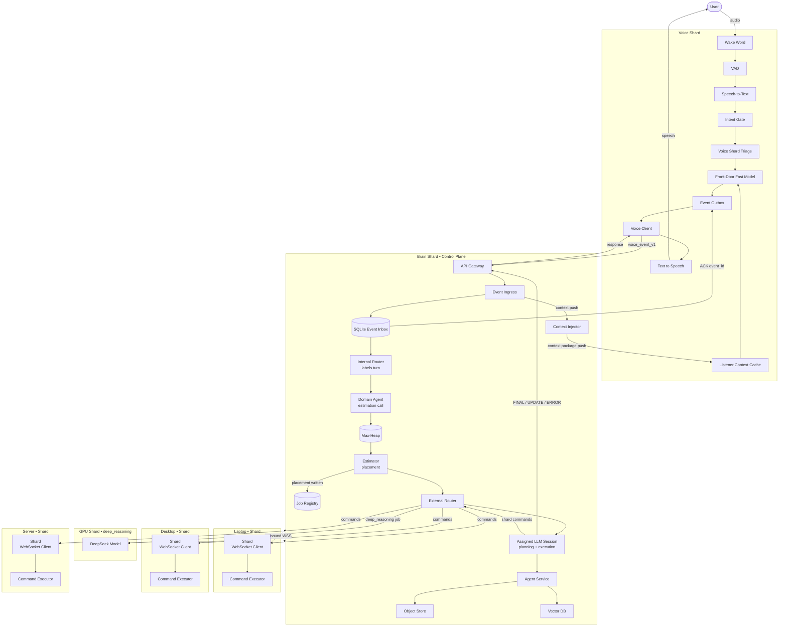
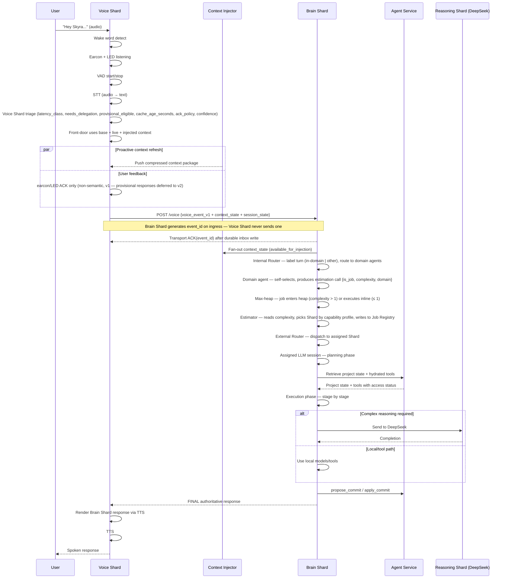

# Personal AI "Jarvis" AKA Skyra – End-Goal Architecture

## 1. Goals

- Always-on personal assistant with voice interaction.
- Agent-centric memory (gym, work, music, servers, etc.).
- Private, local-first inference.
- Modular hardware that can scale over time.
- Fast local responses with automatic escalation to Shards with deep_reasoning capability.

## 2. High-Level Architecture

The system is composed of:

- **Brain Shard** → Control plane (API, orchestration runtime, memory, tools, fast local models)
- **Shards** → Any device that registers its capabilities with the control plane (Voice Shard, laptops, desktops, servers, Reasoning Shards)

Every device in the Skyra network runs a Shard. The Voice Shard has voice capabilities. Reasoning Shards have deep_reasoning capability. The control plane routes work based on what each Shard advertises — not what kind of machine it is.

## 3. Distributed Shard Architecture

### 3.1 Shard Model Overview

Every device in the Skyra network runs a lightweight Shard daemon. A Shard boots, fingerprints the device's hardware and software environment, registers its capabilities with the control plane, and listens for commands. The Brain Shard remains the central orchestrator, sending high-level commands to Shards for execution.

**Shards are execution-only components and do not perform reasoning, memory access, or model inference** (except the Voice Shard's front-door fast model, which is a registered capability of that Shard and runs only as a non-authoritative voice interface).

**Key Concepts:**

- **Control Plane**: Brain Shard maintains intelligence, memory, and decision-making
- **Shards**: Lightweight daemons on target devices, identified by capability profile
- **Command Distribution**: High-level intents sent to Shards for execution
- **Secure Execution**: Allowlisted actions only, with authenticated connections

### 3.2 Distributed System Diagram


```mermaid
flowchart TB
  %% User
  USER([User])

  %% Voice Shard
  subgraph PI[Voice Shard]
    WW[Wake Word]
    VAD[VAD]
    STT[Speech-to-Text]
    GATE[Intent Gate]
    TRIAGE[Voice Shard Triage]
    LCACHE[Listener Context Cache]
    FDOOR[Front-Door Fast Model]
    OBOX[Event Outbox]
    VCLIENT[Voice Client]
    TTS[Text to Speech]
    WW --> VAD --> STT --> GATE --> TRIAGE --> FDOOR
    LCACHE --> FDOOR
    FDOOR --> OBOX --> VCLIENT --> TTS
  end

  %% Control Plane
  subgraph CTRL[Brain Shard • Control Plane]
    direction LR
    APIGW[API Gateway]
    INGRESS[Event Ingress]
    INBOX[(SQLite Event Inbox)]
    IRTR[Internal Router<br/>labels turn]
    DAGENT[Domain Agent<br/>estimation call]
    HEAP[(Max-Heap)]
    EST[Estimator<br/>placement]
    JOBREG[(Job Registry)]
    ERTR[External Router]
    SESSION[Assigned LLM Session<br/>planning + execution]
    CIX[Context Injector]
    PROJ[Agent Service]
    OBJ[Object Store]
    VDB[Vector DB]

    APIGW --> INGRESS --> INBOX --> IRTR --> DAGENT --> HEAP --> EST --> ERTR --> SESSION
    EST -->|placement written| JOBREG
    INGRESS -->|context push| CIX
    SESSION --> PROJ
    PROJ --> OBJ
    PROJ --> VDB
  end

  %% Shards — any device that registers capabilities
  subgraph GPUSHARD[GPU Shard • deep_reasoning]
    DEEP[DeepSeek Model]
  end

  subgraph LAPTOP[Laptop • Shard]
    LAGENT[Shard\nWebSocket Client]
    LEXEC[Command Executor]
    LAGENT --> LEXEC
  end

  subgraph DESKTOP[Desktop • Shard]
    DAGENT2[Shard\nWebSocket Client]
    DEXEC[Command Executor]
    DAGENT2 --> DEXEC
  end

  subgraph SERVER[Server • Shard]
    SAGENT[Shard\nWebSocket Client]
    SEXEC[Command Executor]
    SAGENT --> SEXEC
  end

  %% Request path
  USER -->|audio| WW
  VCLIENT -->|voice_event_v1| APIGW
  INBOX -->|ACK event_id| OBOX

  %% Response path
  SESSION -->|FINAL / UPDATE / ERROR| APIGW
  APIGW -->|response| VCLIENT
  TTS -->|speech| USER

  %% Shard dispatch (External Router)
  ERTR -->|deep_reasoning job| DEEP
  CIX -->|context package push| LCACHE
  SESSION -->|shard commands| ERTR
  ERTR -->|commands| LAGENT
  ERTR -->|commands| DAGENT2
  ERTR -->|commands| SAGENT

  %% Secure outbound connections (Shards initiate)
  LAGENT -.->|outbound WSS| CTRL
  DAGENT2 -.->|outbound WSS| CTRL
  SAGENT -.->|outbound WSS| CTRL
```

### 3.3 Shard Security Model

#### Authentication & Authorization

- **Token-based authentication** using mTLS or JWT tokens
- **Allowlisted commands only** - Shards reject unknown actions
- **Non-root execution** - Shards run as unprivileged users
- **Audit logging** - all commands logged with timestamps and results

#### Command Allowlist

```json
{
  "allowed_actions": {
    "open_vscode": {
      "cmd": "code",
      "args": ["."]
    },
    "open_browser": {
      "cmd": "google-chrome",
      "args": []
    },
    "open_terminal": {
      "cmd": "gnome-terminal",
      "args": []
    },
    "start_docker": {
      "cmd": "docker-compose",
      "args": ["up", "-d"]
    },
    "stop_docker": {
      "cmd": "docker-compose",
      "args": ["down"]
    },
    "start_minecraft_server": {
      "cmd": "systemctl",
      "args": ["start", "minecraft"]
    }
  }
}
```

#### Network Security

- **Outbound connections only** - Shards initiate contact with control plane
- **WebSocket or HTTPS** for secure command channels
- **No inbound ports** - reduces attack surface on Shard machines
- **Command validation** - parameters validated against schemas

### 3.4 Shard Communication Protocol

#### Command Format

```json
{
  "command_id": "cmd_12345",
  "intent": "start_development_environment",
  "action": "start_docker",
  "parameters": {
    "compose_file": "/path/to/docker-compose.yml",
    "services": ["database", "redis"]
  },
  "timeout": 30
}
```

#### Response Format

```json
{
  "command_id": "cmd_12345",
  "status": "success|error|timeout",
  "result": "Docker containers started successfully",
  "exit_code": 0,
  "timestamp": "2026-02-11T22:15:30Z"
}
```

### 3.5 Example Command Flow

**User**: "Skyra, open VS Code on my laptop."

1. **Voice Shard** captures audio → sends text to control plane
2. **Orchestrator** selects target: laptop Shard, action: open_vscode
3. **Control plane** sends command to laptop Shard
4. **Shard** executes local command (`code .`)
5. **Shard** returns result to control plane
6. **Control plane** responds to user: "VS Code opened on your laptop"

---

## 4. Concurrency and Job Model (v1)

All work in Skyra flows through a unified max-heap ordered by importance score. Three inference types: `estimation` (very high priority), `job` (high priority), `batch` (very low priority — idle compute at night). No separate queues or lanes.

Flow:

1. Voice Shard/chat ingress writes event to SQLite inbox (`event_id` idempotent). Brain Shard sends transport ACK.
2. Internal Router reads event, labels turn as in-domain or "other" using the context blob (all agents + relevance scores), and routes to relevant domain agents. Does not assemble a job envelope.
3. Domain agent self-selects relevance and produces an **estimation call**: `{is_job, complexity, domain}`. Complexity is measured in estimated tool calls. Complexity ≤ 1 → execute inline immediately, never enters heap.
4. For complexity > 1: job enters the max-heap. Estimator reads the estimation call output, matches complexity score against shard capability profiles and current load, and writes the placement decision to the Job Registry.
5. External Router dispatches to the assigned Shard.
6. The assigned LLM session performs both task planning and task execution in one continuous context.
7. System emits `UPDATE|PLAN_PROGRESS|CLARIFY|PLAN_APPROVAL_REQUIRED|FINAL|ERROR` events as work progresses.

Higher priority work can preempt in-flight jobs at tool call boundaries. Interrupted job's context window is serialized to a FIFO stack and resumed when the machine is free. See `docs/arch/v1/scheduler.md`.

## 5. Model and Runtime Roles

The system uses a layered runtime: deterministic listener pipeline, fast front-door model, orchestration runtime, and heavy reasoning model.

### Listener Layer (always-on, non-LLM)

The always-on path runs continuously and does not require continuous LLM inference.

- Wake word detection
- Voice activity detection (VAD)
- Speech-to-text (STT)
- Deterministic intent gate (ignore, dispatch, clarification-needed)
- Event-driven front-door LLM invocation after utterance capture

### Listener Device (front-door fast model)

**Front-Door Fast Model**

- Example: Llama 3.2 3B Instruct (quantized)
- Handles:
  - Quick request understanding
  - One-step clarifications
  - Immediate acknowledgement
  - Structured handoff data for orchestration when delegation is needed

### 5.1 Delegate -> Authoritative -> Reconcile Pattern (Strict Mode)

The Voice Shard front-door path is non-authoritative. Voice Shard captures input, emits transport/user ACKs, and relays context-rich JSON. Brain Shard remains the only response authority.

Flow:

1. Voice Shard captures audio, performs STT, and creates `voice_event_v1`.
2. Voice Shard always forwards the event to Brain Shard.
3. Brain Shard performs authoritative processing (task formation, routing, execution, memory commit).
4. Brain Shard may emit `UPDATE` or `CLARIFY` while work is in progress.
5. Brain Shard emits `FINAL` or `ERROR` as authoritative output.
6. Voice Shard speaks only Brain Shard-authored content and updates local turn state.

Behavior by confidence:

- high confidence: minimal user feedback ACK only (earcon/LED, optional "working on it")
- medium confidence: short progress ACK only, no semantic answer
- low confidence: non-verbal ACK only (earcon/LED), wait for Brain Shard result

### 5.2 Voice Shard Triage Layer (Fast Gate)

Before delegation, Voice Shard runs an extremely fast triage stage (rules or tiny model).

Triage outputs:

- `intent`: `{ summary: string, confidence: 0.0-1.0 }`
- `latency_class`: `{ value: interactive | background | deferred, confidence: 0.0-1.0 }`
- `ack_policy`: `{ value: spoken_if_slow | earcon_only | silent, confidence: 0.0-1.0 }` _(values not locked — depends on UX model design)_

v2 planned additions: `needs_delegation`, `hint_target`, `provisional_eligible`, `cache_age_seconds`

> For the authoritative schema see `skyra/schemas/ingress/voice/`.

Notes:

- triage output is a hint, not final authority
- triage does not replace Brain Shard-side task formation or estimation
- Brain Shard remains source of truth

### Brain Shard (orchestration + tools)

**Coding / Tool Model**

- Example: Qwen2.5-Coder 7B
- Handles:
  - Script generation
  - Code editing
  - Tool execution
  - CLI-style tasks

### Deep Reasoning Shards

**Primary Reasoning Model**

Shards that register with `deep_reasoning` capability run large local models for complex inference.

- Example: DeepSeek-Coder 33B+ on a Reasoning Shard
- Handles:
  - Complex coding
  - Architecture decisions
  - Multi-file reasoning
  - Deep debugging
  - Long-context tasks

### 5.3 Reasoning Shard — DeepSeek Model Selection Notes (Preliminary)

Status:

- Final production model/precision is not decided yet.
- Priority for this decision path is correctness over speed.

Comparison matrix (preliminary):

| Option | Model size | Precision         | VRAM estimate               | Accuracy | Speed          | Notes                                               |
| ------ | ---------- | ----------------- | --------------------------- | -------- | -------------- | --------------------------------------------------- |
| A      | 70B        | NVFP4 (emulated)  | ~40GB (requires offload)    | ~99%     | Slow           | Best accuracy/performance balance on 4-bit path     |
| B      | 70B        | FP8 / AWQ         | ~35-40GB                    | ~97-98%  | Moderate       | Reliable fallback if NVFP4 emulation is too slow    |
| C      | 32B        | FP16 (no quant)   | ~65GB (requires offload)    | ~100%    | Fast           | Zero quantization risk                              |
| D      | 32B        | 8-bit             | ~16-18GB (fits 4090 VRAM)   | ~98-99%  | Very fast      | Efficient and fully in-VRAM                         |

NVFP4 note:

- NVFP4 is expected to retain high accuracy on long-context and complex workloads versus generic 4-bit approaches.
- RTX 4090 (Ada Lovelace) does not have native NVFP4 hardware support, but software emulation can be enabled:

```bash
export VLLM_USE_NVFP4_CT_EMULATIONS=1
```

- Emulation path keeps accuracy benefits with potential speed penalty.

Correctness-first recommendation path:

1. Try Option A first (70B NVFP4 emulation).
2. If too slow, move to Option B (70B FP8/AWQ).
3. If quantization risk must be minimized, use Option C (32B FP16) or Option D (32B 8-bit).

## 6. System Topology Diagram


```mermaid
flowchart LR
  %% ===== Nodes =====
  subgraph PI[Voice Shard]
    direction LR
    WW[Wake Word<br/>openWakeWord or Porcupine]
    VAD[Voice Activity Detection]
    STT[Speech to Text<br/>Whisper small or base]
    TTS[Text to Speech<br/>Piper or Coqui]
    GATE[Intent Gate<br/>deterministic]
    TRIAGE[Voice Shard Triage<br/>fast gate]
    LCACHE[Listener Context Cache<br/>base + live + injected]
    FDOOR[Front-Door Fast Model\nLlama 3.2 3B]
    UACK[User Feedback ACK<br/>earcon led spoken hint]
    OBOX[Local Event Outbox<br/>durable plus retry]
    VCLIENT[Voice Client<br/>HTTP or gRPC to API]
    WW --> VAD --> STT --> GATE --> TRIAGE --> FDOOR
    TRIAGE --> UACK
    LCACHE --> FDOOR
    FDOOR --> TTS
    FDOOR --> OBOX
    OBOX --> VCLIENT
  end

  subgraph MAC[Brain Shard • Control Plane]
    direction LR
    APIGW[API Gateway<br/>FastAPI or Node<br/>voice chat tools memory]
    INGRESS[Event Ingress<br/>WS or gRPC receiver]
    INBOX[(SQLite Inbox<br/>PRIMARY KEY event_id)]
    IRTR[Internal Router<br/>labels turn<br/>routes to domain agents]
    DAGENT[Domain Agent<br/>self-selects<br/>estimation call]
    HEAP[(Max-Heap<br/>all work by importance)]
    EST[Estimator<br/>reads complexity<br/>picks Shard by capability]
    JOBREG[(Job Registry<br/>job lifecycle state)]
    ERTR[External Router<br/>dispatches to target Shard]
    SESSION[Assigned LLM Session<br/>planning + execution]
    CIX[Context Injector Service<br/>watches state, pushes to devices]

    CODER[Coding Tool Model<br/>Qwen2.5 Coder 7B]

    PROJ[Agent Service<br/>Registry Commits Tools]
    TOOLS[Tool Skills Runner<br/>SSH scripts Slack]
    OBJ[(Object Store<br/>.skyra/agents<br/>versioned state)]
    VDB[(Vector DB<br/>Chroma<br/>semantic index + tool registry)]

    APIGW --> INGRESS --> INBOX --> IRTR --> DAGENT --> HEAP --> EST --> ERTR --> SESSION
    EST -->|placement written| JOBREG
    INGRESS -->|state change| CIX
    SESSION --> CODER
    SESSION --> PROJ
    SESSION --> TOOLS
    PROJ --> OBJ
    PROJ --> VDB
  end

  subgraph GPUSHARD[GPU Shard • deep_reasoning]
    LLM[DeepSeek Reasoning Model<br/>33B plus<br/>LLM Server]
  end

  %% ===== Links between machines =====
  VCLIENT -->|voice_event_v1 + context_state| APIGW
  PI -.->|optional audio stream for remote STT| APIGW
  CIX -->|compressed context package| LCACHE
  INBOX -->|transport ACK event_id| OBOX
  ERTR -->|deep_reasoning job| LLM
  LLM -->|completion| SESSION
  SESSION -->|FINAL / UPDATE / ERROR| APIGW
  APIGW -->|authoritative result| VCLIENT
  VCLIENT -->|final speech output| TTS
```

## 7. Voice Request Flow


```mermaid
sequenceDiagram
  participant User
  participant Pi as Voice Shard
  participant CIX as Context Injector
  participant Mac as Brain Shard
  participant PROJ as Agent Service
  participant GPU as Reasoning Shard (DeepSeek)

  User->>Pi: "Hey Skyra..." (audio)
  Pi->>Pi: Wake word detect
  Pi->>Pi: Earcon + LED listening
  Pi->>Pi: VAD start/stop
  Pi->>Pi: STT (audio → text)
  Pi->>Pi: Voice Shard triage (latency_class, needs_delegation, provisional_eligible, cache_age_seconds, ack_policy, confidence)
  Pi->>Pi: Front-door uses base + live + injected context
  par Proactive context refresh
    CIX-->>Pi: Push compressed context package
  and User feedback
    Pi->>Pi: earcon/LED ACK only (non-semantic, v1 — provisional responses deferred to v2)
  end

  Pi->>Mac: POST /voice {voice_event_v1 + context_state + session_state}
  Note over Pi,Mac: Brain Shard generates event_id on ingress — Voice Shard never sends one
  Mac-->>Pi: Transport ACK(event_id) after durable inbox write
  Mac->>CIX: Fan-out context_state (available_for_injection)

  Mac->>Mac: Internal Router — label turn (in-domain | other), route to domain agents
  Mac->>Mac: Domain agent — self-selects, produces estimation call {is_job, complexity, domain}
  Mac->>Mac: Max-heap — job enters heap (complexity > 1) or executes inline (≤ 1)
  Mac->>Mac: Estimator — reads complexity, picks Shard by capability profile, writes to Job Registry
  Mac->>Mac: External Router — dispatch to assigned Shard
  Mac->>Mac: Assigned LLM session — planning phase
  Mac->>PROJ: Retrieve project state + hydrated tools
  PROJ-->>Mac: Project state + tools with access status
  Mac->>Mac: Execution phase — stage by stage
  alt Complex reasoning required
    Mac->>GPU: Send to DeepSeek
    GPU-->>Mac: Completion
  else Local/tool path
    Mac->>Mac: Use local models/tools
  end
  Mac->>PROJ: propose_commit / apply_commit
  Mac-->>Pi: FINAL authoritative response
  Pi->>Pi: Render Brain Shard response via TTS
  Pi->>Pi: TTS
  Pi-->>User: Spoken response
```

### 7.1 Consistency and Reconciliation Model

**v1 decision**: Voice Shard emits non-semantic ACKs only (earcon, LED, short wait phrase). Voice Shard does not generate provisional semantic responses in v1. The reconciliation model below describes Voice Shard rendering Brain Shard-authored messages — that behavior applies fully in v1.

> **v2 note**: A provisional response path where Voice Shard speaks a fast local answer before Brain Shard responds (using the front-door model and `provisional_eligible` triage hint), then reconciles on `FINAL`, can significantly reduce perceived latency. Deferred to v2 — the contradiction-handling and Voice Shard state-tracking complexity outweighs the benefit until the core response loop is stable.

Problem: maintaining single-authoritative response semantics with asynchronous backend processing.

Failure mode to avoid:

1. Voice Shard emits semantic content before backend decision is complete.
2. Backend result differs.
3. User receives contradictory answers in one turn.

Design principle: Delegate -> Authoritative -> Reconcile

1. Delegate (Voice Shard -> Brain Shard): event is always sent to Brain Shard.
2. Authoritative process (Brain Shard): only Brain Shard can produce semantic result.
3. Reconcile (Brain Shard -> Voice Shard): Voice Shard renders Brain Shard messages and commits turn state.

Voice Shard speech guardrails

Voice Shard is allowed to:

- status acknowledgements ("I'm checking...", "One sec...")
- transport/progress signals (earcon, LED, short wait phrase)

Voice Shard must not:

- generate semantic answers from local context
- claim an action completed unless confirmed by Brain Shard
- claim state changes occurred unless confirmed by Brain Shard
- write or modify system memory

Reconciliation protocol (Brain Shard -> Voice Shard)

Brain Shard responses include:

- `message_type`: `FINAL | UPDATE | PLAN_PROGRESS | CLARIFY | PLAN_APPROVAL_REQUIRED | ERROR`
- `job_id`: `string`
- `text`: `string`

Message types:

- `FINAL`
  - authoritative response
  - supersedes any prior progress ACK text
  - marks job complete
- `UPDATE`
  - intermediate progress
  - may include user-facing status text
  - does not mark job complete
- `PLAN_PROGRESS`
  - planning-stage progress update
  - optional user-facing status text
  - does not mark job complete
- `CLARIFY`
  - requests missing information from user
  - Voice Shard asks clarification instead of asserting uncertain content
- `PLAN_APPROVAL_REQUIRED`
  - plan is ready and waiting for user decision
  - expected user response: `APPROVE | REVISE | CANCEL`
- `ERROR`
  - authoritative failure result
  - Voice Shard should give concise failure output and next step

Reconciliation behavior on Voice Shard:

- If `UPDATE` arrives first, Voice Shard may emit short progress speech based on `ack_policy`.
- Voice Shard may render `PLAN_PROGRESS` as short status.
- Voice Shard speaks `CLARIFY`, `PLAN_APPROVAL_REQUIRED`, `FINAL`, and `ERROR` as authoritative turn content.
- Voice Shard appends authoritative output to local context window and closes the turn on `FINAL|ERROR`.

### 7.2 Formal Turn Loop Algorithm (Hear -> JSON Voice Shard -> Backend -> Context Manager)

This algorithm enforces that Voice Shard cannot answer on its own.

#### 7.2.1 State machine

`IDLE -> LISTENING -> TRANSCRIBED -> FORWARDED -> ACKED -> RUNNING -> RESOLVED`

`RUNNING -> RUNNING` on `UPDATE`  
`RUNNING -> LISTENING` on `CLARIFY`  
`RUNNING -> RESOLVED` on `FINAL|ERROR`

#### 7.2.2 Voice Shard-side pseudocode

```python
def on_user_utterance(audio_chunk_stream):
    turn_id = new_turn_id()
    transcript = stt(audio_chunk_stream)
    triage = pi_fast_triage(transcript)
    context_window = context_manager.snapshot_for_turn(turn_id)

    event = {
        "schema": "voice_event_v1",
        "turn_id": turn_id,
        "ts": now_iso8601(),
        "transcript": transcript,
        "triage_hints": triage,
        "context_window": context_window,
    }

    outbox.persist(event)  # Voice Shard outbox tracked by turn_id; Brain Shard generates event_id on ingress
    emit_user_ack(triage["ack_policy"])  # non-semantic ACK only
    transport.send(event)

    while True:
        msg = transport.recv_for_turn(turn_id, timeout=TURN_TIMEOUT_S)
        if msg is None:
            transport.retry_from_outbox(event["turn_id"])
            continue

        if msg["message_type"] in ("UPDATE", "PLAN_PROGRESS"):
            maybe_speak_progress(msg["text"], triage["ack_policy"])
            continue

        if msg["message_type"] == "CLARIFY":
            tts_speak(msg["text"])
            context_manager.append_assistant(turn_id, msg["text"], authoritative=True)
            return "needs_user_input"

        if msg["message_type"] == "PLAN_APPROVAL_REQUIRED":
            tts_speak(msg["text"])
            context_manager.append_assistant(turn_id, msg["text"], authoritative=True)
            return "awaiting_plan_approval"

        if msg["message_type"] in ("FINAL", "ERROR"):
            tts_speak(msg["text"])
            context_manager.append_assistant(turn_id, msg["text"], authoritative=True)
            outbox.delete_if_acked(event["turn_id"])
            return "resolved"
```

#### 7.2.3 Backend reconciliation contract

> For the authoritative v1 schema and hydration model see `skyra/schemas/ingress/voice/`. The example below reflects the current v1 design.

Request (`Voice Shard -> Brain Shard`):

```json
{
  "schema": "voice_event_v1",
  "turn_id": "turn_8f4c",
  "ts": "2026-02-20T18:10:12Z",
  "device_id": "pi-livingroom-01",
  "transcript": "what did I decide about backups",
  "triage_hints": {
    "intent": {
      "summary": "user wants to know what was decided about backups",
      "confidence": 0.94
    },
    "latency_class": {
      "value": "interactive",
      "confidence": 0.88
    },
    "ack_policy": {
      "value": "spoken_if_slow",
      "confidence": 0.76
    }
  },
  "session_state": {
    "pending_job_id": null,
    "waiting_for": null
  }
}
```

Note: `event_id` is NOT part of `voice_event_v1`. Brain Shard generates `event_id` (ULID) on ingress and returns it in the transport ACK. Voice Shard does not stamp `event_id`. Voice Shard tracks outbox entries by `turn_id`; `(session_id, turn_id)` is the deduplication key at Brain Shard ingress. See `docs/arch/v1/event-ingress-ack.md` for the full contract.

v2 additions: `pi_gave_provisional`, `provisional_text`, `context_window`, `context_state` — deferred, see `skyra/schemas/ingress/voice/CHANGELOG.md`.

Response stream (`Brain Shard -> Voice Shard`):

```json
{
  "schema": "voice_result_v1",
  "event_id": "01JS...",
  "turn_id": "turn_8f4c",
  "message_type": "UPDATE|PLAN_PROGRESS|CLARIFY|PLAN_APPROVAL_REQUIRED|FINAL|ERROR",
  "text": "authoritative text",
  "memory_patch": {
    "summary_delta": "...",
    "facts_upsert": []
  },
  "commit": {
    "agent_id": "server_ops",
    "commit_id": "cmt_12ab"
  },
  "ts": "2026-02-20T18:10:15Z"
}
```

Rules:

- `event_id` is idempotency key across retries.
- Voice Shard never fabricates `memory_patch` or `commit`.
- Context Manager applies backend-authored `memory_patch` only after `FINAL|ERROR`.

### Optional: Remote STT Acceleration (Voice Shard -> Brain Shard Audio Streaming)

Purpose:

Allow the Voice Shard to stream captured audio to the Brain Shard so speech-to-text can run on the more powerful control plane. This reduces time to first spoken response for short utterances.

This feature is optional and not required for the base architecture.

When enabled:

1. Wake word is detected on Voice Shard.
2. Voice Shard begins capturing audio.
3. Voice Shard streams audio chunks to Brain Shard over a low-latency channel.
4. Brain Shard performs streaming or fast batch STT.
5. Brain Shard continues normal processing:
   - turn labeling and domain agent routing
   - estimation call
   - heap placement
   - task formation
   - execution
6. Brain Shard returns response text to Voice Shard.
7. Voice Shard performs TTS and speaks the result.

Performance target:

- Remote STT enabled: first substantive spoken response ~`500-900 ms` (best case).
- Local Voice Shard STT path: typical ~`900-1600 ms`.

Transport options (implementation-agnostic):

- WebSocket (preferred for simplicity)
- gRPC streaming
- QUIC or another low-latency protocol

Audio format guidance:

- mono
- `16 kHz` or `24 kHz`
- small chunked frames

## 8. Component Responsibilities

### 8.1 Voice Shard

**Purpose**: Always-on audio interface and deterministic listener pipeline.

**Services**:

- Wake word detection
- VAD (voice activity detection)
- Speech-to-text (STT)
- Optional remote audio streaming to Brain Shard for accelerated STT
- Text-to-speech (TTS)
- Intent gate (deterministic rules + tiny classifier)
- Voice Shard triage layer (fast gate that emits routing/latency hints)
- Front-door fast model (event-driven, not always-on inference)
- Voice client that sends text to Brain Shard

**Characteristics**:

- Lightweight compute
- Always powered on
- Local network only
- No heavy reasoning models on this node

### 8.1.1 Voice Shard Guardrails (Authoritative-Only Behavior)

The Voice Shard remains a listener/transport/render node and is non-authoritative for semantic responses.

- Voice Shard may emit non-semantic ACKs (earcon, LED, short wait phrase).
- Voice Shard must not generate semantic answers from local cache or models.
- Voice Shard must not claim actions were executed unless confirmed by Brain Shard.
- Voice Shard must not write memory or commit state.
- Voice Shard speaks authoritative backend content only (`UPDATE|PLAN_PROGRESS|CLARIFY|PLAN_APPROVAL_REQUIRED|FINAL|ERROR`).

### 8.2 Brain Shard – Control Plane

**Purpose**: Orchestration, memory, APIs, tools, and fast local models.

**Services**:

- API gateway (/chat, /voice, /tools, /memory)
- Orchestration runtime (LangGraph orchestrator + router)
- Internal Router (turn labeling + domain agent routing)
- Agent Service
- Tool execution engine
- Databases
- Local conversational model
- Local coding/tool model

**Local Models**:

| Model                 | Role                                 |
| --------------------- | ------------------------------------ |
| Qwen2.5-Coder 7B      | Coding and tool execution            |

**Datastores**:

- Relational DB (agents, events, preferences)
- Vector DB (embeddings)
- Object storage (documents)

### 8.2.1 Internal Router

**Purpose**: Turn labeling and domain agent routing. Labels the incoming turn as in-domain or "other" using the context blob (all agents + relevance scores), routes to relevant domain agents. Job formation is NOT the Internal Router's job — that is the domain agent's responsibility.

**Responsibilities**:

- Dequeue event
- Attach context blob (pushed by CIX, already available)
- Label turn via front face transformer (in-domain | other)
- Route to relevant domain agents
- Store turn in RDS with routing metadata (batch reads this at night for non-routed agents)

**Does not**: assemble job envelopes, make placement decisions, or write to the Job Registry. Those belong to the domain agent and Estimator respectively.

### 8.2.2 Estimator

**Purpose**: Placement decision maker. Reads the estimation call output produced by the domain agent, matches the complexity score against registered shard capability profiles and current load, and assigns the job to the best available machine.

**Responsibilities**:

- Read estimation call output: `{is_job, complexity, domain}`
- Match complexity score (in estimated tool calls) to shard capability profiles
- Select target Shard based on capability match and current load
- Write placement decision to Job Registry

| Complexity | Likely target |
|---|---|
| ≤ 1 | Inline — never reaches Estimator |
| 2–5 | Mac mini class |
| 6+ | GPU machine or most capable available shard |

**Does not**: dispatch the job directly (that is External Router's job). Does not track ongoing job state beyond the placement write.

### 8.2.3 External Router

**Purpose**: Receives the Estimator's placement decision and dispatches the job to the right Shard. The boundary between internal control-plane logic and the Shard network.

**Responsibilities**:

- Receive placement decision from Estimator
- Dispatch the job to the target Shard over the appropriate transport (WebSocket/gRPC)
- Handle dispatch-level retries and errors

**Does not**: make routing decisions. It executes the decision the Estimator already made.

### 8.2.4 Job Registry

**Purpose**: Passive source of truth for job lifecycle state. Records where each job is at any point in time. Does not make decisions.

**Lifecycle states**: `created → routed → planning → executing → done | failed`

**Responsibilities**:

- Record job placement written by Estimator
- Track lifecycle transitions as the job progresses through the LLM session
- Serve as audit trail for job history

**Does not**: route, schedule, or make any decisions. It is a state store, not a decision maker. (This replaces what was previously called "Scheduler".)

### 8.3 Deep Reasoning Shards

**Purpose**: Heavy reasoning and large-model inference. Any device that registers with `deep_reasoning` capability becomes a deep reasoning Shard. The Estimator selects which Reasoning Shard receives the job based on complexity score, capability profiles, and current load; the External Router dispatches accordingly.

**Currently**: one Reasoning Shard running DeepSeek-Coder 33B+.

**Services**:

- DeepSeek-Coder (33B+)
- LLM server (vLLM, TGI, or Ollama)

**Characteristics**:

- Dedicated GPU
- High VRAM
- Private network access only

**Model Role**:

| Model               | Purpose              |
| ------------------- | -------------------- |
| DeepSeek-Coder 33B+ | Main reasoning brain |

## 9. Agent Architecture

All agent state is owned and managed by the Agent Service. See `skyra/internal/agent/README.md` for the full specification.

### 9.1 Agent Registry (SQLite)

A lightweight fast-read index above the object store. Used by the context engine as a first gate before any deeper retrieval.

```sql
CREATE TABLE agents (
  agent_id       TEXT PRIMARY KEY,
  name           TEXT NOT NULL,
  status         TEXT NOT NULL DEFAULT 'active',
  -- active | paused | archived
  last_active_at TEXT NOT NULL
);
```

### 9.2 Object Store (System of Record)

**Structure**:

```
.skyra/agents/{agent_id}/
  HEAD.json            ← pointer to current commit
  state.json           ← materialized current state (four sections)
  commits/             ← immutable commit history
    {commit_id}.json
  working/             ← executor scratch pad (mutable, not versioned)
  jobs/
    {job_id}/
      tasks/
        {task_id}/
          tasksheet.json  or  workplan.json
          notes.md
```

**state.json sections**:

- `metadata` — name, status, created_at, last_active_at
- `knowledge` — goals, assumptions, decisions, facts
- `artifact` — what the agent is and where it lives
- `boundary` — structured operating constraints: `scope` (prose), `allowed_tool_categories`, `denied_tool_patterns`, and `restrictions[]` (each with `id`, `description`, `matches`). Enforced in code at two layers: hydration (lock status attached to tools before LLM sees them) and BoundaryValidator (permission prompt at runtime before execution). Not via prompt.

**Usage**:

- Versioned agent state via append-only commit objects
- AI modifications through explicit commits only via Agent Service
- File-based storage (local Phase 1) or S3/MinIO (distributed Phase 2)

### 9.3 Two-Level Status

Job status exists at two distinct levels that must not be conflated:

- **Operational status** (Job Registry): `created | routed | planning | executing | done | failed` — owned by the Job Registry, tracks machinery
- **Semantic status** (tasksheet in object store): `forming | pending_approval | executing | done | cancelled` — owned by the Agent Service, tracks meaning

### 9.4 Vector Store (Derived Data)

The vector DB serves two purposes:

1. **Agent state index** — embedded snapshots of agent state for semantic retrieval. Derived from object store. Can be rebuilt at any time. Not source of truth.
2. **Local tool registry** — per-agent tools indexed for retrieval. Each tool carries `agent_id`, `categories[]` (operation tags matched by boundary enforcement), and `requires_approval` as metadata fields.

### 9.5 Retrieval Strategy (Commit + Semantic + Temporal)

1. Context engine queries agent registry (SQLite) — all agents returned, no active/inactive filter. The context blob carries all agents with relevance scores (data integrity over context management).
2. Vector store retrieves semantically similar content with temporal metadata.
3. Object store provides recent commit context.
4. Results re-ranked by commit recency, semantic similarity, agent relevance, temporal weight.
5. Top results injected into context package.

Tools are NOT part of the context package. Tool retrieval happens inside the LLM session: Agent Service retrieves local tools via vector search, hydrates each with an `access` field (`status: allowed | locked`), and returns the full list to the Domain Expert. Locked tools are visible but caught by BoundaryValidator before execution.

**Rule**: Vector store finds relevant content; object store provides authoritative state; agent registry provides the full agent roster with relevance scores.

## 10. Orchestration Layer

The orchestration runtime runs on the Brain Shard as the central orchestrator and model router.

Service and shard catalog reference:

- `docs/arch/v1/agents-services.md`

**Framework decision**:

- **LangGraph** is the primary orchestration runtime for stateful workflows, routing, retries, and checkpointed execution.
- **LangChain** is used for integrations (model clients, retrievers, tool wrappers), not as the primary orchestration layer.

**Execution pipeline (unified max-heap)**:

1. Receive message, persist to SQLite inbox, send transport ACK
2. Internal Router labels turn (in-domain | other) using context blob, routes to domain agents
3. Domain agent self-selects relevance, produces estimation call: `{is_job, complexity, domain}`
4. Complexity ≤ 1 → execute inline. Complexity > 1 → job enters max-heap
5. Estimator reads estimation call output, picks target Shard by capability profile + load, writes placement to Job Registry
6. External Router dispatches job to assigned Shard
7. Assigned LLM session performs task formation:
   - no task
   - ephemeral task (`WorkPlan`)
   - stateful task (`TaskSheet` + `Patch`)
8. Same LLM session executes tools/steps
9. Write memory updates via commits (user-approved)
10. Return final authoritative response

Safety/policy enforcement for high-risk actions is intentionally deferred to a later iteration.

### 10.1 Task Formation Pipeline

Task formation runs inside the LLM session assigned by the Estimator:

1. Event arrives from ingress, persisted to SQLite inbox.
2. Internal Router labels turn, routes to domain agents via context blob.
3. Domain agent self-selects and produces estimation call `{is_job, complexity, domain}`.
4. Complexity ≤ 1 → inline execution. Complexity > 1 → heap → Estimator places to capable Shard.
5. External Router dispatches to the assigned Shard; LLM session begins.
6. Domain Expert (inside assigned session) decides:
   - no task
   - ephemeral task (`WorkPlan`)
   - stateful task (`TaskSheet` + `Patch`)
7. Optional review pass for high-complexity or ambiguous formations.
8. Canonical task object continues directly into execution in the same session.

Important boundary:

- The Estimator owns placement decisions — it reads complexity from the estimation call and matches to shard capability profiles. No lane assignment — capability profiles drive routing.
- Job Registry is a passive state tracker. It records placement and lifecycle transitions but does not make routing decisions.
- Transport ACK confirms durable ingest only; execution may occur later from the heap.

References:
- `docs/arch/v1/task-formation.md`
- `skyra/internal/taskformation`

### 10.2 Canonical Processing Pipeline and Ownership

Canonical pipeline:

```
Voice Shard → Event Ingress → SQLite inbox → Internal Router → Domain Agent (estimation call)
                                                   ↓                        ↓
                                                  RDS              [Max-Heap] → Estimator → External Router → LLM Session
                                                                                    ↓
                                                                             Job Registry
```

The Estimator writes placement to the Job Registry. The Job Registry tracks job lifecycle (`created → routed → planning → executing → done/failed`) but makes no routing decisions.

Voice Shard responsibilities:

- produce event
- produce triage hints
- optional non-semantic user feedback ACK

Brain Shard responsibilities:

- own event ingress and durable inbox
- own Internal Router (turn labeling, domain agent routing)
- own max-heap (all work ordered by importance score)
- own Estimator (placement decisions, capability-based Shard selection)
- own Job Registry (job lifecycle state)
- own External Router (job dispatch to target Shard)
- own LLM session (task formation + execution)
- own memory commits

## 11. Network Layout

### Logical network

- All machines on same LAN/VLAN
- Token or mTLS between services
- No public exposure of Reasoning Shard

### Trust zones

| Zone    | Devices                                                                  | Role                                              |
| ------- | ------------------------------------------------------------------------ | ------------------------------------------------- |
| Control | Brain Shard                                                              | Orchestration + memory + fast models              |
| Shard   | Voice Shard, laptops, desktops, servers, Reasoning Shards                | Device execution layer — capability-driven        |

## 12. Deployment Strategy

Reference implementation example:
- `docs/examples/model-endpoint-phase1.md`

### Phase 1 (single machine)

Brain Shard runs:

- Llama conversational model
- Qwen coding model
- API
- Memory
- Orchestration runtime (LangGraph)

### Phase 2 (two machines)

- Reasoning Shard hosts DeepSeek
- Brain Shard runs control plane + local models

### Phase 3 (three machines)

- Voice Shard handles voice
- Full modular architecture

## 13. Security Baseline

- Token-based service authentication
- Separate service accounts
- Tool allow-list
- Audit logs
- Encrypted backups

## 14. Event Ingress and ACK Reliability

Skyra uses an at-least-once event delivery contract between listener and control plane.

Listener side:

- Structured proposal/event is written to local outbox first.
- Event is retried over transport (WebSocket or gRPC) until ACK.
- Outbox record is deleted only after ACK for the same `event_id`.

Control plane side:

- Ingress receives event and writes to durable SQLite inbox.
- Inbox uses `event_id` as PRIMARY KEY for duplicate-safe inserts.
- ACK is sent only after durable commit succeeds.

Reference design:
- `docs/arch/v1/event-ingress-ack.md`

### 14.1 ACK Types

Skyra uses two different acknowledgements that must not be conflated.

Transport ACK (machine-to-machine):

- sent from Brain Shard to Voice Shard only after durable inbox write
- drives outbox delete behavior
- never spoken to the user

User Feedback ACK (human-facing):

- earcon, LED, or optional short phrase
- chosen by Voice Shard using triage `ack_policy`
- independent from transport reliability ACK
- may be emitted before queued execution starts

## 15. End-State Role Assignment

| Shard          | Role                                             |
| -------------- | ------------------------------------------------ |
| Reasoning Shard | DeepSeek reasoning model                        |
| Brain Shard    | LangGraph orchestration runtime, APIs, memory, tools, fast models |
| Voice Shard    | Always-on listener, front-door model, TTS        |

## 16. Example Capabilities

- "What did I decide about the Tekkit backups last week?"
- "Switch to work mode—draft a SOC2 response."
- "Gym mode—suggest next week's lifts."
- "Music mode—ideas for SKANZ Vol. 3."
- "Server mode—summarize crash logs."

For every request:

**Input**:

- User message
- Recent chat history
- Agent registry

**Output**:

- agent_id
- intent
- confidence score

If confidence is low:

- Ask clarification
- Or search across multiple agents

## 17. Telemetry and Monitoring

### 17.1 Model-Level Metrics

- Request count per model (Llama/Qwen vs DeepSeek)
- Response times and token counts
- GPU utilization during DeepSeek calls
- Memory usage per inference request
- Cache hit rates for local models

### 17.2 User Interaction Metrics

- Voice-to-text latency
- End-to-end request/response time
- Routing decision accuracy (was DeepSeek escalation needed?)
- User satisfaction signals (voice follow-ups, task completion)

### 17.3 System Health

- Network latency between machines
- Database query performance
- Model warm-up times
- Error rates and escalation triggers

### 17.4 Cost Tracking

- Energy consumption per machine
- GPU compute time cost estimates
- Storage usage trends
- Peak vs average resource utilization

### 17.5 Implementation

- Prometheus metrics on each machine
- Simple dashboard in the Brain Shard control plane
- Alerts when DeepSeek usage spikes unusually
- Weekly summaries of model usage patterns

### 17.6 Key Focus: Routing Efficiency

Track the system's ability to correctly choose local vs GPU models and analyze the tradeoffs between response time and accuracy.

## 18. Planned Extensions

The following sections describe high-level architectural concepts that will be designed in more detail in future iterations. These are included to guide the long-term evolution of the system without constraining the initial implementation.

### 18.1 TV Node Architecture (Planned)

The system may include a dedicated TV node consisting of a small computer (mini PC or Voice Shard-class device) connected to a television via HDMI. This node will run a Skyra Shard and act as the primary media execution environment.

In this model:

The TV becomes a display only.

All media playback occurs on the local TV node through a browser or local apps.

Jarvis controls playback by interacting directly with the local execution environment.

High-level goals:

Avoid limitations of smart TV and streaming device APIs.

Allow full control of streaming services through web interfaces.

Enable the system to read what is currently playing.

Provide reliable, scriptable media control.

Hardware selection, browser automation, and media control logic will be designed in a later iteration.

### 18.2 Mobile Interaction via Progressive Web App (Planned)

Jarvis will expose a secure web interface that can be installed on a phone as a Progressive Web App (PWA). This will provide a native-like experience without requiring a dedicated mobile application.

High-level goals:

Chat-style interface for natural language commands.

Quick action buttons for common tasks.

Real-time system and device status.

Optional push notifications.

The exact UI design, authentication model, and notification system will be defined in a future version.

### 18.3 Voice Authorization Model (Planned)

The voice subsystem will include a speaker-aware authorization layer so that only approved users can control the system.

High-level components:

Wake word detection.

Speaker identification.

Command authorization based on recognized voice profiles.

This ensures that unauthorized users cannot issue commands.
High-risk or destructive actions may require additional spoken confirmation.

Specific models, thresholds, and security policies will be defined in a later design phase.

### 18.4 Streaming Device Integration Strategy (Planned)

The system will support multiple types of media devices, using the most appropriate control method for each platform.

High-level strategy:

Use direct APIs where available (e.g., Roku power or input control).

Use casting or device-level control for platforms like Android TV.

Prefer a local TV node for full automation when APIs are limited.

Media endpoints will be treated as device nodes with defined capabilities.
Detailed control logic for each platform will be designed later.

### 18.5 External Device Control Model (Planned)

Not all devices will run native Shards. Some will be controlled through network protocols or automation bridges.

High-level concepts:

Certain devices (TVs, smart devices, streaming boxes) are controlled via:

Local network APIs

Casting protocols

Automation bridges

The control plane maintains a centralized device registry.

High-level intents are mapped to device-specific actions.

Multiple device types are supported under a unified abstraction.

The device capability schema and integration patterns will be defined in a future design phase.

### 18.6 Remote Access Model (Planned)

Remote clients (such as phones or laptops outside the home network) will access Jarvis through a secure overlay network.

High-level concept:

The control plane is not exposed directly to the public internet.

Remote devices connect through a secure mesh or VPN-style network.

All interactions occur over authenticated, encrypted channels.

Authentication, session management, and final network topology will be specified in a later iteration.
