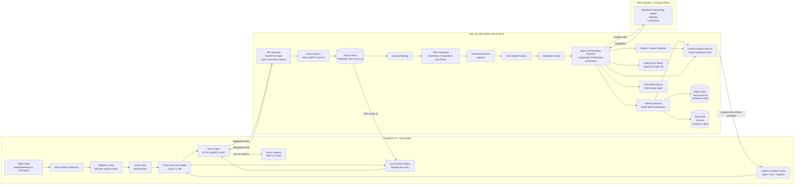

# Personal AI "Jarvis" AKA Skyra – End-Goal Architecture

## 1. Goals

- Always-on personal assistant with voice interaction.
- Project-centric memory (gym, work, music, servers, etc.).
- Private, local-first inference.
- Modular hardware that can scale over time.
- Fast local responses with automatic escalation to a high-reasoning GPU model.

## 2. High-Level Architecture

The system is composed of three main machines:

- **Raspberry Pi** → Voice interface (wake word, STT, TTS)
- **Mac mini** → Control plane (API, orchestration runtime, memory, tools, fast local models)
- **GPU Machine** → Heavy reasoning model (DeepSeek LLM server)

Each machine has a clear responsibility.

## 3. Distributed Agent Architecture

### 3.1 Agent Model Overview

Each computer (laptop, desktop, server) runs a lightweight "Jarvis Agent" that extends the system's reach beyond the central control plane. The Mac mini remains the central orchestrator, sending high-level commands to agents for execution.

**Jarvis Agents are execution-only components and do not perform reasoning, memory access, or model inference.**

**Key Concepts:**

- **Control Plane**: Mac mini maintains intelligence, memory, and decision-making
- **Jarvis Agents**: Lightweight services on target machines
- **Command Distribution**: High-level intents sent to agents for execution
- **Secure Execution**: Allowlisted actions only, with authenticated connections

### 3.2 Distributed System Diagram


### 3.3 Agent Security Model

#### Authentication & Authorization

- **Token-based authentication** using mTLS or JWT tokens
- **Allowlisted commands only** - agents reject unknown actions
- **Non-root execution** - agents run as unprivileged users
- **Audit logging** - all commands logged with timestamps and results

#### Command Allowlist

```json
{
  "allowed_actions": {
    "open_vscode": {
      "cmd": "code",
      "args": ["."]
    },
    "open_browser": {
      "cmd": "google-chrome",
      "args": []
    },
    "open_terminal": {
      "cmd": "gnome-terminal",
      "args": []
    },
    "start_docker": {
      "cmd": "docker-compose",
      "args": ["up", "-d"]
    },
    "stop_docker": {
      "cmd": "docker-compose",
      "args": ["down"]
    },
    "start_minecraft_server": {
      "cmd": "systemctl",
      "args": ["start", "minecraft"]
    }
  }
}
```

#### Network Security

- **Outbound connections only** - agents initiate contact with control plane
- **WebSocket or HTTPS** for secure command channels
- **No inbound ports** - reduces attack surface on agent machines
- **Command validation** - parameters validated against schemas

### 3.4 Agent Communication Protocol

#### Command Format

```json
{
  "command_id": "cmd_12345",
  "intent": "start_development_environment",
  "action": "start_docker",
  "parameters": {
    "compose_file": "/path/to/docker-compose.yml",
    "services": ["database", "redis"]
  },
  "timeout": 30
}
```

#### Response Format

```json
{
  "command_id": "cmd_12345",
  "status": "success|error|timeout",
  "result": "Docker containers started successfully",
  "exit_code": 0,
  "timestamp": "2026-02-11T22:15:30Z"
}
```

### 3.5 Example Command Flow

**User**: "Jarvis, open VS Code on my laptop."

1. **Voice node** captures audio → sends text to control plane
2. **Orchestrator** selects target: laptop, action: open_vscode
3. **Control plane** sends command to laptop Jarvis Agent
4. **Agent** executes local command (`code .`)
5. **Agent** returns result to control plane
6. **Control plane** responds to user: "VS Code opened on your laptop"

---

## 4. Concurrency and Job Model (Planned)

The system will eventually support multiple concurrent user requests across voice, chat, and agent interactions. A formal job queue, request lifecycle management, and concurrency limits will be designed in a future iteration to ensure proper resource allocation and response ordering. This portion of the architecture is intentionally deferred for a later version to focus on core functionality first.

## 5. Model and Runtime Roles

The system uses a layered runtime: deterministic listener pipeline, fast front-door model, orchestration runtime, and heavy reasoning model.

### Listener Layer (always-on, non-LLM)

The always-on path runs continuously and does not require continuous LLM inference.

- Wake word detection
- Voice activity detection (VAD)
- Speech-to-text (STT)
- Deterministic intent gate (ignore, dispatch, clarification-needed)
- Event-driven front-door LLM invocation after utterance capture

### Listener Device (front-door fast model)

**Front-Door Fast Model**

- Example: Llama 3.2 3B Instruct (quantized)
- Handles:
  - Quick request understanding
  - One-step clarifications
  - Immediate acknowledgement
  - Structured handoff data for orchestration when delegation is needed

### Mac mini (orchestration + tools)

**Coding / Tool Model**

- Example: Qwen2.5-Coder 7B
- Handles:
  - Script generation
  - Code editing
  - Tool execution
  - CLI-style tasks

### GPU Machine (heavy reasoning model)

**Primary Reasoning Model**

- Example: DeepSeek-Coder 33B+
- Handles:
  - Complex coding
  - Architecture decisions
  - Multi-file reasoning
  - Deep debugging
  - Long-context tasks

## 6. System Topology Diagram



## 7. Voice Request Flow


## 8. Component Responsibilities

### 8.1 Raspberry Pi – Voice Node

**Purpose**: Always-on audio interface and deterministic listener pipeline.

**Services**:

- Wake word detection
- VAD (voice activity detection)
- Speech-to-text (STT)
- Text-to-speech (TTS)
- Intent gate (deterministic rules + tiny classifier)
- Front-door fast model (event-driven, not always-on inference)
- Voice client that sends text to Mac mini

**Characteristics**:

- Lightweight compute
- Always powered on
- Local network only
- No heavy reasoning models on this node

### 8.2 Mac mini – Control Plane

**Purpose**: Orchestration, memory, APIs, tools, and fast local models.

**Services**:

- API gateway (/chat, /voice, /tools, /memory)
- Orchestration runtime (LangGraph orchestrator + router)
- Project classifier
- Model router
- Memory service
- Tool execution engine
- Databases
- Local conversational model
- Local coding/tool model

**Local Models**:

| Model                 | Role                                 |
| --------------------- | ------------------------------------ |
| Qwen2.5-Coder 7B      | Coding and tool execution            |

**Datastores**:

- Relational DB (projects, events, preferences)
- Vector DB (embeddings)
- Object storage (documents)

### 8.3 GPU Machine – Compute Plane

**Purpose**: Heavy reasoning and large-model inference.

**Services**:

- DeepSeek-Coder (33B+)
- LLM server (vLLM, TGI, or Ollama)

**Characteristics**:

- Dedicated GPU
- High VRAM
- Private network access only

**Model Role**:

| Model               | Purpose              |
| ------------------- | -------------------- |
| DeepSeek-Coder 33B+ | Main reasoning brain |

## 9. Memory Architecture

### 9.1 Object Store (System of Record)

**Structure**:

- `.skyra/projects/{project}/`
- HEAD.json (current commit pointer)
- state.json (materialized current state)
- commits/ (immutable commit objects)
- attachments/ (files, documents)

**Usage**:

- Versioned project state via commit objects
- AI modifications through explicit commits only
- File-based storage (local) or S3/MinIO (distributed)

### 9.3 Vector Store (Derived Data)

**Stores**:

- Embedded project state snapshots
- Embedded documents and attachments
- Semantic index for fast retrieval

**Characteristics**:

- Can be rebuilt from object store
- Not source of truth
- Used for semantic search only

## 9.4. Retrieval Strategy (Commit + Semantic + Temporal)

1. Classifier determines project domain.
2. Vector store retrieves semantically similar content with temporal metadata.
3. Object store provides recent commit context.
4. Results are re-ranked by:
   - Commit recency
   - Semantic similarity
   - Project relevance
   - Temporal importance (recent events weighted higher)
5. Top results injected into LLM prompt with timestamp context.

**Rule**: Vector store finds relevant content; object store provides authoritative state; temporal metadata adds context.

## 10. Orchestration Layer

The orchestration runtime runs on the Mac mini as the central orchestrator and model router.

**Framework decision**:

- **LangGraph** is the primary orchestration runtime for stateful workflows, routing, retries, and checkpointed execution.
- **LangChain** is used for integrations (model clients, retrievers, tool wrappers), not as the primary orchestration layer.

**Agent pipeline**:

1. Receive message
2. Run project and intent classifier
3. Build structured job envelope:
   - `project_id`
   - `intent`
   - `priority`
   - `required_tools`
   - `can_run_async`
4. Retrieve memory context
5. Route task:
   - Llama (conversation)
   - Qwen (coding/tools)
   - DeepSeek (GPU reasoning)
6. Execute tools if needed
7. Write memory updates
8. Return final response

Safety/policy enforcement for high-risk actions is intentionally deferred to a later iteration.

### 10.1 Task Formation Pipeline

Before scheduler intake, control plane performs task formation on accepted voice/chat events:

1. Event arrives from ingress.
2. Domain routing selects candidate project/domain context.
3. Domain expert decides:
   - no task
   - ephemeral task (`WorkPlan`)
   - stateful task (`TaskSheet` + `Patch`)
4. Optional review pass for high-complexity or ambiguous formations.
5. Canonical task object is created and handed to scheduler.

Important boundary:

- Scheduler design is still in progress.
- Estimation is only one scheduler component, not the full scheduler.

References:
- `docs/arch/v1/task-formation.md`
- `skyra/internal/taskformation`

## 11. Network Layout

### Logical network

- All machines on same LAN/VLAN
- Token or mTLS between services
- No public exposure of GPU machine

### Trust zones

| Zone    | Machine      | Role                                 |
| ------- | ------------ | ------------------------------------ |
| Edge    | Raspberry Pi | Voice input/output                   |
| Control | Mac mini     | Orchestration + memory + fast models |
| Compute | GPU box      | Deep reasoning model                 |

## 12. Deployment Strategy

Reference implementation example:
- `docs/examples/model-endpoint-phase1.md`

### Phase 1 (single machine)

Mac mini runs:

- Llama conversational model
- Qwen coding model
- API
- Memory
- Orchestration runtime (LangGraph)

### Phase 2 (two machines)

- GPU box hosts DeepSeek
- Mac mini runs control plane + local models

### Phase 3 (three machines)

- Raspberry Pi handles voice
- Full modular architecture

## 13. Security Baseline

- Token-based service authentication
- Separate service accounts
- Tool allow-list
- Audit logs
- Encrypted backups

## 14. Event Ingress and ACK Reliability

Skyra uses an at-least-once event delivery contract between listener and control plane.

Listener side:

- Structured proposal/event is written to local outbox first.
- Event is retried over transport (WebSocket or gRPC) until ACK.
- Outbox record is deleted only after ACK for the same `event_id`.

Control plane side:

- Ingress receives event and writes to durable SQLite inbox.
- Inbox uses `event_id` as PRIMARY KEY for duplicate-safe inserts.
- ACK is sent only after durable commit succeeds.

Reference design:
- `docs/arch/v1/event-ingress-ack.md`

## 15. End-State Role Assignment

| Machine      | Role                                             |
| ------------ | ------------------------------------------------ |
| GPU Box      | DeepSeek reasoning model                         |
| Mac mini     | LangGraph orchestration runtime, APIs, memory, tools, fast models |
| Raspberry Pi | Voice interface                                  |

## 16. Example Capabilities

- "What did I decide about the Tekkit backups last week?"
- "Switch to work mode—draft a SOC2 response."
- "Gym mode—suggest next week's lifts."
- "Music mode—ideas for SKANZ Vol. 3."
- "Server mode—summarize crash logs."

For every request:

**Input**:

- User message
- Recent chat history
- Project registry

**Output**:

- project_id
- intent
- confidence score

If confidence is low:

- Ask clarification
- Or search across multiple projects

## 17. Telemetry and Monitoring

### 17.1 Model-Level Metrics

- Request count per model (Llama/Qwen vs DeepSeek)
- Response times and token counts
- GPU utilization during DeepSeek calls
- Memory usage per inference request
- Cache hit rates for local models

### 17.2 User Interaction Metrics

- Voice-to-text latency
- End-to-end request/response time
- Routing decision accuracy (was DeepSeek escalation needed?)
- User satisfaction signals (voice follow-ups, task completion)

### 17.3 System Health

- Network latency between machines
- Database query performance
- Model warm-up times
- Error rates and escalation triggers

### 17.4 Cost Tracking

- Energy consumption per machine
- GPU compute time cost estimates
- Storage usage trends
- Peak vs average resource utilization

### 17.5 Implementation

- Prometheus metrics on each machine
- Simple dashboard in the Mac mini control plane
- Alerts when DeepSeek usage spikes unusually
- Weekly summaries of model usage patterns

### 17.6 Key Focus: Routing Efficiency

Track the system's ability to correctly choose local vs GPU models and analyze the tradeoffs between response time and accuracy.

## 18. Planned Extensions

The following sections describe high-level architectural concepts that will be designed in more detail in future iterations. These are included to guide the long-term evolution of the system without constraining the initial implementation.

### 18.1 TV Node Architecture (Planned)

The system may include a dedicated TV node consisting of a small computer (mini PC or Raspberry Pi) connected to a television via HDMI. This node will run a Jarvis/Skyra agent and act as the primary media execution environment.

In this model:

The TV becomes a display only.

All media playback occurs on the local TV node through a browser or local apps.

Jarvis controls playback by interacting directly with the local execution environment.

High-level goals:

Avoid limitations of smart TV and streaming device APIs.

Allow full control of streaming services through web interfaces.

Enable the system to read what is currently playing.

Provide reliable, scriptable media control.

Hardware selection, browser automation, and media control logic will be designed in a later iteration.

### 18.2 Mobile Interaction via Progressive Web App (Planned)

Jarvis will expose a secure web interface that can be installed on a phone as a Progressive Web App (PWA). This will provide a native-like experience without requiring a dedicated mobile application.

High-level goals:

Chat-style interface for natural language commands.

Quick action buttons for common tasks.

Real-time system and device status.

Optional push notifications.

The exact UI design, authentication model, and notification system will be defined in a future version.

### 18.3 Voice Authorization Model (Planned)

The voice subsystem will include a speaker-aware authorization layer so that only approved users can control the system.

High-level components:

Wake word detection.

Speaker identification.

Command authorization based on recognized voice profiles.

This ensures that unauthorized users cannot issue commands.
High-risk or destructive actions may require additional spoken confirmation.

Specific models, thresholds, and security policies will be defined in a later design phase.

### 18.4 Streaming Device Integration Strategy (Planned)

The system will support multiple types of media devices, using the most appropriate control method for each platform.

High-level strategy:

Use direct APIs where available (e.g., Roku power or input control).

Use casting or device-level control for platforms like Android TV.

Prefer a local TV node for full automation when APIs are limited.

Media endpoints will be treated as device nodes with defined capabilities.
Detailed control logic for each platform will be designed later.

### 18.5 External Device Control Model (Planned)

Not all devices will run native Jarvis agents. Some will be controlled through network protocols or automation bridges.

High-level concepts:

Certain devices (TVs, smart devices, streaming boxes) are controlled via:

Local network APIs

Casting protocols

Automation bridges

The control plane maintains a centralized device registry.

High-level intents are mapped to device-specific actions.

Multiple device types are supported under a unified abstraction.

The device capability schema and integration patterns will be defined in a future design phase.

### 18.6 Remote Access Model (Planned)

Remote clients (such as phones or laptops outside the home network) will access Jarvis through a secure overlay network.

High-level concept:

The control plane is not exposed directly to the public internet.

Remote devices connect through a secure mesh or VPN-style network.

All interactions occur over authenticated, encrypted channels.

Authentication, session management, and final network topology will be specified in a later iteration.
